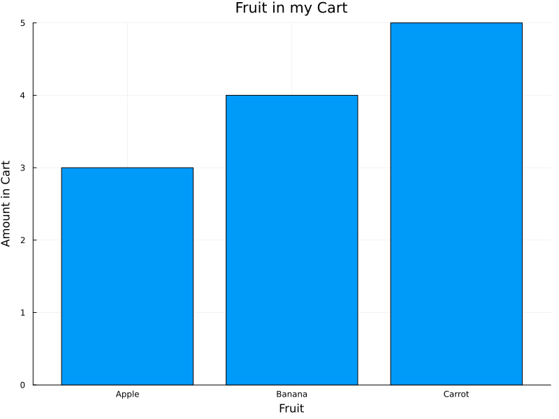

# Contributing

## Code of Conduct

This project and everyone participating in it is governed by the
[Code of Conduct](code_of_conduct.md).
By participating, you are expected to uphold this code. Please report unacceptable behavior
to <mariah.knowles@wisc.edu>.

## I Have a Question

Before you ask a question, it is best to search for existing [issues](https://github.com/Tiny-Earth/DemoSite/issues) and [pull requests](https://github.com/Tiny-Earth/DemoSite/pulls) that might help you. If you find a related issue to your question but still need clarification, you can respond to that issue with your question.

If you can't find a related issue, we recommend the following:

- Open an [issue](https://github.com/Tiny-Earth/DemoSite/issues/new).
- Provide as much context as you can about what you're running into.

We will then respond to your question as soon as possible.

## I Want To Contribute

!!! danger "Legal Notice"

    When contributing to this project, you must agree that you have authored 100% of the content, that you have the necessary rights to the content, and that the content you contribute may be provided under the project license.

### Reporting Bugs

#### Before Submitting a Bug Report

A good bug report shouldn't leave others needing to chase you up for more information. Therefore, we ask you to investigate carefully, collect information and describe the issue in detail in your report. Please complete the following steps in advance to help us fix any potential bug as fast as possible.

- Make sure that you are viewing the latest version.
- Determine if your bug is really a bug and not an error on your side.
- To see if other users have experienced (and potentially already solved) the same issue you are having, check if there is not already a bug report existing for your bug or error in the [bug tracker](https://github.com/Tiny-Earth/DemoSite/issues?q=label%3Abug).
- Collect information about the bug:
    - OS, Platform and Version (Windows, Linux, macOS, x86, ARM)
    - Can you reliably reproduce the issue?

#### How Do I Submit a Good Bug Report?

!!! danger "Report sensitive bugs privately"

    You must never report security related issues, vulnerabilities or bugs including sensitive information to the issue tracker, or elsewhere in public. Instead sensitive bugs must be sent by email to <mariah.knowles@wisc.edu>.

We use issues to track bugs and errors. If you run into an issue with the project:

1. Open an [issue](https://github.com/Tiny-Earth/DemoSite/issues/new). (Since we can't be sure at this point whether it is a bug or not, we ask you not to talk about a bug yet and not to label the issue.)
2. Explain the behavior you would expect and the actual behavior.
3. Please provide as much context as possible and describe the *reproduction steps* that someone else can follow to recreate the issue on their own. For good bug reports you should isolate the problem and create a reduced test case.
4. Provide the information you collected in the previous section.

Once it's filed:

1. The project team will label the issue accordingly.
2. A team member will try to reproduce the issue with your provided steps. If there are no reproduction steps or no obvious way to reproduce the issue, the team will ask you for those steps and mark the issue as `needs-repro`. Bugs with the `needs-repro` tag will not be addressed until they are reproduced.
3. If the team is able to reproduce the issue, it will be marked `needs-fix`, as well as possibly other tags (such as `critical`), and the issue will be addressed.

### Suggesting Enhancements

This section guides you through submitting an enhancement suggestion for SCIENTIFIC TEACHING COURSE, **including completely new features and minor improvements to existing functionality**. Following these guidelines will help maintainers and the community to understand your suggestion and find related suggestions.

#### Before Submitting an Enhancement

- Make sure that you are viewing the latest version.
- Read the version completely and carefully to see if your enhancement is already covered.
- Perform a [search](https://github.com/Tiny-Earth/DemoSite/issues) to see if the enhancement has already been suggested. If it has, add a comment to the existing issue instead of opening a new one.
- Find out whether your idea fits with the scope and aims of the project. It's up to you to make a strong case to convince the project's developers of the merits of this feature. Keep in mind that we want features that will be useful to the majority of our users and not just a small subset. If you're just targeting a minority of users, consider writing add-on content that could be [referenced as a resource](resources.md).

#### How Do I Submit a Good Enhancement Suggestion?

Enhancement suggestions are tracked as [issues](https://github.com/Tiny-Earth/DemoSite/issues) and [pull requests](https://github.com/Tiny-Earth/DemoSite/pulls).

- Use a **clear and descriptive title** for the issue to identify the suggestion.
- Provide a **step-by-step description of the suggested enhancement** in as many details as possible.
- **Describe the current behavior** and **explain which behavior you expected to see instead** and why. At this point you can also tell which alternatives do not work for you.
- You may want to **include screenshots and animated GIFs** which help you demonstrate the steps or point out the part which the suggestion is related to. You can use [this tool](https://www.cockos.com/licecap/) to record GIFs on macOS and Windows, and [this tool](https://github.com/colinkeenan/silentcast) or [this tool](https://github.com/GNOME/byzanz) on Linux.
- **Explain why this enhancement would be useful** to most SCIENTIFIC TEACHING COURSE users. You may also want to point out the other projects that solved it better and which could serve as inspiration.

## Your First Contribution

To contribute course content:

1. Before contributing, review our [issues](https://github.com/Tiny-Earth/DemoSite/issues) and [pull requests](https://github.com/Tiny-Earth/DemoSite/pulls) to see if someone else has already suggested your idea or a similar one. If they have, create a GitHub account, sign-in, and join the conversation!
2. Otherwise, while viewing the page you wish to suggest a change to, click the pencil icon at the very top of the page.
3. You should see the content for the page, written in a format called Markdown. See the Markdown Styleguide below for more.
4. If you haven't yet, create a GitHub account and sign-in.
5. If you would like to suggest an edit directly:
    1. While viewing the page's content on GitHub, follow GitHub's instructions for [editing files in another user's repository](https://docs.github.com/en/repositories/working-with-files/managing-files/editing-files#editing-files-in-another-users-repository). In your commit message, follow the same style as a Good Enhancement Suggestion described above.
    2. Once you've submitted your pull request, your content suggestion will then be reviewed by team members, possibly discussed as an [issue](https://github.com/Tiny-Earth/DemoSite/issues/) with the community, and, if accepted, incorporated into the course.
    3. Please [review your GitHub notification settings](https://docs.github.com/en/account-and-profile/managing-subscriptions-and-notifications-on-github/setting-up-notifications/configuring-notifications#choosing-your-notification-settings) and periodically visit our [pull requests](https://github.com/Tiny-Earth/DemoSite/pulls) to track progress on your suggestion!
6. If you would prefer to describe your suggestion generally and have others make the direct edit for you:
    1. While viewing the page's content on GitHub, follow GitHub's instructions for [creating an issue from code](https://docs.github.com/en/issues/tracking-your-work-with-issues/creating-an-issue#creating-an-issue-from-code). In your issue comment, follow the same style as a Good Enhancement Suggestion described above.
    2. Once you've submitted your issue, your content suggestion will then be reviewed by team members, possibly discussed with the community, and, if accepted, incorporated into the course.
    3. Please [review your GitHub notification settings](https://docs.github.com/en/account-and-profile/managing-subscriptions-and-notifications-on-github/setting-up-notifications/configuring-notifications#choosing-your-notification-settings) and periodically visit our [issues](https://github.com/Tiny-Earth/DemoSite/issues) to track progress on your suggestion!

## Markdown Styleguide

### Text

```md
# This is a Page Title

## This is a section heading (will appear in sidebar table of contents)

### This is a subsection heading (will not appear in sidebar)

This is a normal paragraph.

This is *italics*, this is **bold**, and this is math $p < .001$.

> This is a block quote. I shall do by my patients as I would be done by;
> shall obtain consultation whenever I or they desire; shall include them
> to the extent they wish in all important decisions; and shall minimize
> suffering whenever a cure cannot be obtained, understanding that a dignified
> death is an important goal in everyone's life.

This is a bulleted list:

- Apple
- Banana
- Carrot

This is a numbered list:

1. Apple
2. Banana
3. Carrot
```

### Links and Citations

Please do not include hyperlinks in course content, regardless of whether the link goes to an outside source or another page on this site.

If you wish to link to external content, instead do so as a citation:

1. If the reference is an academic research paper, locate it on Google Scholar, click "cite," then click "BibTeX." Otherwise, use a tool like [bibme](https://www.bibme.org/bibtex) to generate the BibTeX.
2. [Edit bib.tex](https://github.com/Tiny-Earth/DemoSite/blob/main/site/src/refs.bib) and paste your citation's BibTeX at the end, leaving one blank line between citation entries. Double check that the bibliographic information is correct, as sometimes Google Scholar and bibme can make factual mistakes. And if you are aware that one or more of the authors has changed their preferred name, please update the citation to reflect that, as this is the [current practice in MLA](https://style.mla.org/citing-author-who-has-transitioned/).
3. Edit the page(s) where the content should be referenced, using the appropriate citation link format shown below. The text `handelsman_achieving_2022` and `Moss-Racusin2012-cm` refer to the citation keys in the [bib.tex](https://github.com/Tiny-Earth/DemoSite/blob/main/site/src/refs.bib) file.
4. Please make it clear in your commit messages that these edits go together, and a team member will link them together in an issue, where they can be reviewed, discussed, and accepted if appropriate.

```md
This is a citation with one reference [handelsman_achieving_2022](@cite).

This is a citation with multiple references [handelsman_achieving_2022,Moss-Racusin2012-cm](@cite).

This is a citation with additional text inside the parentheses [handelsman_achieving_2022; Table 1](@cite).
```

Please do all citations in this way, so that the format is consistent and all bibliographic information is listed on the same page.

### Images

!!! danger "Legal Notice reminder"

    Reminder, when contributing to this project, you must agree that you have authored 100% of the content, that you have the necessary rights to the content, and that the content you contribute may be provided under the project license. This goes for images too.

1. Upload the image you wish to in course content to [the assets folder](https://github.com/Tiny-Earth/DemoSite/tree/main/site/src/assets). Use the title of the figure as the image's file name, in all lowercase, and replacing spaces with hyphens. For example, `actions-to-create-inclusive-stem-college-classrooms.png`.
2. Edit the page where the image should be included, using the image reference format shown below.
3. Please make it clear in your commit messages that these edits go together, and a team member will link them together in an issue, where they can be reviewed, discussed, and accepted if appropriate.

```md
This is an image:


```

### Plots

When we need to create plots ourselves based on published data, we can do this directly within the document, like the example below. This involves two steps: First, we use a `@setup` to execute Julia code as the website is being generated, producing our needed image file on the fly. And second, we embed the image and alt text as usual.

Please save the images with a `.svg` extension, to take advantage of SVG's ability to scale down without information loss. And please continue to use the title of the figure as the image's file name, in all lowercase, and replacing spaces with hyphens. For example, `assets/fruit-in-my-cart.svg`.

For a wealth of information on plotting in Julia, [see the Plots.jl documentation](https://docs.juliaplots.org/stable/).

```@setup fruits
using StatsPlots
p = plot(title="Fruit in my Cart", size=(800, 600), xlabel="Fruit", ylabel="Amount in Cart")
plot!(p, ["Apple", "Banana", "Carrot"], [3, 4, 5], seriestype=:bar, label=nothing)
savefig(p, "assets/fruit-in-my-cart.svg")
```



````md
```@setup fruits
using StatsPlots
p = plot(title="Fruit in my Cart", size=(800, 600), xlabel="Fruit", ylabel="Amount in Cart")
plot!(p, ["Apple", "Banana", "Carrot"], [3, 4, 5], seriestype=:bar, label=nothing)
savefig(p, "assets/fruit-in-my-cart.svg")
```


````

### Activities and Workbooks

For activities that are simple, reflective questions, use this format:

!!! note "Activity Title"

    Write your question and activity content here!

```md
!!! note "Activity Title"

    Write your question and activity content here!
```

For activities that have fill in the blank answers, use this format:

!!! note "Activity Title"

    Write your ____ and ____ content here!
    
    (This is the question part of the activity)

    ```@raw html
    <details><summary>Click here to reveal the answer!</summary>
    ```

    question and activity
    
    (This is the hidden answer part of the activity that can be revealed)

    ```@raw html
    </details>
    ```

````md
!!! note "Activity Title"

    Write your ____ and ____ content here!
    
    (This is the question part of the activity)

    ```@raw html
    <details><summary>Click here to reveal the answer!</summary>
    ```

    question and activity
    
    (This is the hidden answer part of the activity that can be revealed)

    ```@raw html
    </details>
    ```
````

For activities that have multiple choice answers, use this format:

!!! note "Activity Title"

    Where is Tiny Earth HQ located?

    - A. New York
    - B. Atlanta
    - C. Madison
    - D. Seattle

    ```@raw html
    <details><summary>Click here to reveal the answer!</summary>
    ```

    C

    ```@raw html
    </details>
    ```

````md
!!! note "Activity Title"

    Where is Tiny Earth HQ located?

    - A. New York
    - B. Atlanta
    - C. Madison
    - D. Seattle

    ```@raw html
    <details><summary>Click here to reveal the answer!</summary>
    ```

    C

    ```@raw html
    </details>
    ```
````

And for workbook activities, use this format:

!!! warning "Workbook Activity Title"

    Complete Activity (number) in your workbook: Short version of the activity prompt here.

```md
!!! warning "Workbook Activity Title"

    Complete Activity (number) in your workbook: Short version of the activity prompt here.
```

### Tables

Please do not use tables to display content, as making these accessibility friendly is difficult.

Instead, describe in a paragraph and/or bullet points what the key insights of the table would have been.

## Attribution
This guide is based on [contributing-gen](https://github.com/bttger/contributing-gen).