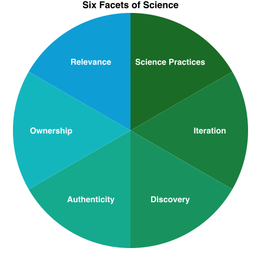

# Course Design

!!! warning ""
    This site is still under development. Thank you for previewing it! Your feedback is much appreciated -- [Let us know what you think!](https://uwmadison.co1.qualtrics.com/jfe/form/SV_eaCduZfaBtfNpRA)

```@raw html
<!-- TODO insert vignette videos from Sarah K here -->
```

```@raw html
<!-- `TODO this is about a 40 minute read, resolve` -->
```

---
## Module Goals

`NOTE: This content was restructured recently. Its goals need to be rewritten.`

---
## Course Design Defined

!!! compat ""
    `NOTE: This content was restructured recently. Its objectives need to be rewritten.`

What is course design?

It is an intentional, reflective process of developing effective learning materials and environments that encourage students to develop their skills and knowledge. 

In designing a course, we set goals and adopt strategies for students and teachers to achieve learning outcomes.

### A Rubric for Course Design

The following six statements make up a "rubric" to help gauge effective course design:

1. The course is designed using evidence-based practices.
2. Students likely feel that the course is inclusive, fosters belonging and supports learning.
3. The course materials promote ideas and concepts related to antiracism, justice, equity, diversity, and inclusion.
4. Students know what is expected of them in the course.
5. Activities and assessments reinforce the learning objectives.
6. Students have multiple chances to interact with the content, with each other, and with the instructional team.

!!! note ""
    #### Apply a Rubric for Course Design

    The following description of a course meets these 6 statements. Match each of the bolded parts to the part(s) of the rubric they align with.

    > My primary goal is to create a **supportive environment** where all students **feel a sense of belonging** and are excited to learn about astronomy.
    > 
    > To achieve this, I employ many strategies:
    > 
    > - I like to **learn more about my students** such as their interests, prior knowledge, and career goals.
    > - I then craft my course materials to **include their interests and connections to their lives**.
    > - Additionally, I like to **highlight the various ways different cultures learned about and used** the night sky. For example, Polynesians used celestial knowledge to navigate long-distance ocean voyages.
    > - To increase clarity and transparency, **all learning objectives are provided** in the syllabus and in lecture notes.
    > - **Mastery-oriented rubrics** are also provided to students **to help them know what I'm looking for** in their term papers.
    > - Lastly, my course includes multiple assignments before, during, and after class to help provide **low-stakes opportunities for practice and feedback**. In particular, I like to use the **jigsaw activity** in class so that students have a **sense or ownership and can learn from each other**.

!!! note ""
    #### Rating Courses with a Rubric

    Read each of the following vignettes, and then rate the course and its instructor for each of the six elements.

    !!! details "Click here to show Vignette #1"
        > My genetics course uses the premiere \$300 textbook that covers all the founding fathers' discoveries. I give two-hour multiple-choice exams from 6-8pm on Tuesdays every 5 weeks. The final is cumulative and all exams are graded on a curve. All content is delivered through the textbook and my lectures. There are no worksheets or homework assignments - I'm not going to tell them what's important and what to study. I pride myself in weeding out students who aren't cut out to be genetics majors. We only want the best of the best in our program.

        1. How well is the course designed using evidence-based practices? 0 (absent/ unsure), 1 (developing), 2 (present)
        2. How well are students likely to feel that the course is inclusive, fosters belonging and supports learning? 0 (absent/ unsure), 1 (developing), 2 (present)
        3. How well do the course materials promote ideas and concepts related to antiracism, justice, equity, diversity, and inclusion? 0 (absent/ unsure), 1 (developing), 2 (present)
        4. How well do students know what is expected of them in the course? 0 (absent/ unsure), 1 (developing), 2 (present)
        5. How well do the activities and assessments reinforce the learning objectives? 0 (absent/ unsure), 1 (developing), 2 (present)
        6. How well do students have multiple chances to interact with the content, with each other, and with the Instructional team? 0 (absent/ unsure), 1 (developing), 2 (present)

    !!! details "Click here to show Vignette #2"
        > Students in my chemistry course know what is expected of them. The learning objectives are transparent, and we do a variety of student-centered activities in class that help them practice skills related to the objectives. We ask and answer scientific questions with relevance to their lives, and I highlight the work of diverse scientists whenever possible. We connect the science to historical legacies of exclusion and privilege in science. Everything for class is on our learning management system, which ensures students can find materials even if they miss class. I have built a lot of structure in my course such as pre-class readings/quizzes and post-class reflection assignments to help students monitor and progress their learning. I use frequent low-stakes assessments with timely feedback, and I make sure to tell them it's ok to make mistakes while they are learning-that's what class is for. I encourage students to ask questions and to work together to generate their own understanding. I really love talking with my students. They bring so much curiosity and enthusiasm to the class.

        1. How well is the course designed using evidence-based practices? 0 (absent/ unsure), 1 (developing), 2 (present)
        2. How well are students likely to feel that the course is inclusive, fosters belonging and supports learning? 0 (absent/ unsure), 1 (developing), 2 (present)
        3. How well do the course materials promote ideas and concepts related to antiracism, justice, equity, diversity, and inclusion? 0 (absent/ unsure), 1 (developing), 2 (present)
        4. How well do students know what is expected of them in the course? 0 (absent/ unsure), 1 (developing), 2 (present)
        5. How well do the activities and assessments reinforce the learning objectives? 0 (absent/ unsure), 1 (developing), 2 (present)
        6. How well do students have multiple chances to interact with the content, with each other, and with the Instructional team? 0 (absent/ unsure), 1 (developing), 2 (present)

    !!! details "Click here to show Vignette #3"
        > My department chair showed me the data about students in my engineering course. Not only do 18% of them fail each semester, the majority of those who fail are students of color, women, or first-generation students. This really bothered me, so I've been trying to make some changes, but I don't know how to specifically help those students. I mostly stick to the textbook but have added in a few diverse examples of engineers who are women and persons of color. I have a syllabus with some flexibility in due dates, and I let them drop their lowest exam score. In class, I stop and ask if people have questions, but they almost never do. Lab is interactive and students work in pairs. It's worth 30% of their grade, so when they make mistakes and their designs fail, it can adversely affect their final grades. In my course evaluations, students said I wasn't approachable and that I talk too fast, but then nobody comes to my office hours for help even though I say I'm available.

        1. How well is the course designed using evidence-based practices? 0 (absent/ unsure), 1 (developing), 2 (present)
        2. How well are students likely to feel that the course is inclusive, fosters belonging and supports learning? 0 (absent/ unsure), 1 (developing), 2 (present)
        3. How well do the course materials promote ideas and concepts related to antiracism, justice, equity, diversity, and inclusion? 0 (absent/ unsure), 1 (developing), 2 (present)
        4. How well do students know what is expected of them in the course? 0 (absent/ unsure), 1 (developing), 2 (present)
        5. How well do the activities and assessments reinforce the learning objectives? 0 (absent/ unsure), 1 (developing), 2 (present)
        6. How well do students have multiple chances to interact with the content, with each other, and with the Instructional team? 0 (absent/ unsure), 1 (developing), 2 (present)

!!! tip ""
    #### Self-Evaluation with a Rubric

    *Answer in your workbook:*

    Continuing with the same rubric, let's evaluate your own course. Take a moment to call up materials in your mind, on your computer, or wherever you have the ideas saved. Write where you think your course is now for each of the six statements listed here. Then, describe where you would like it to be. Finally, describe what changes it make take and you are willing to do to get it there.
    
    If you do not have your own course to evaluate, think about a favorite STEM course you previously took or TA'd for.

    1. How well is the course designed using evidence-based practices?
    2. How well are students likely to feel that the course is inclusive, fosters belonging and supports learning?
    3. How well do the course materials promote ideas and concepts related to antiracism, justice, equity, diversity, and inclusion?
    4. How well do students know what is expected of them in the course?
    5. How well do the activities and assessments reinforce the learning objectives?
    6. How well do students have multiple chances to interact with the content, with each other, and with the Instructional team?

---
## Why Course Design

Science teachers are designers: You select content. You modify it for your courses. You create presentations and you craft lectures. You prepare online course space so students can find the assignments they need. You prepare physical lab space so the flow of traffic does not impede hands-on learning. You plan, you adapt, you iterate.


And like in any type of design—from technology, to paintings, to skyscrapers, and yes, to science courses—you make decisions. Your decisions help you approach your aims, within your constraints. You’ll make decisions about your teaching before the semester begins, while teaching a unit, and after you’ve seen how it all played out. From designing new courses, to overhauling an old design you’ve inherited, and to continuously improving your teaching, as a science teacher you are as much a designer as you are a scientist.

In all three of these roles—teacher, scientist, designer—you hold a number of commitments that are relevant to, inspire, and inform how you carry out your course [flanagan2005values,flanagan2014values,belman2009instructional](@cite). As a teacher, you are likely committed to delivering on the specific learning objectives of your courses. As a scientist, you may be committed to a certain bar of rigor in your work, and as a science teacher you may be committed to instilling a sense of this rigor in your students. And so on.

Only you can know what your own commitments are and the ways they:

- Shape what you aspire to achieve in your work as a science teacher
- Motivate you to pursue your own degree of quality
- Guide you to explore and weigh between design alternatives

!!! tip ""
    #### Reflect on Your Design Decisions

    *Answer in your workbook:* Take a moment to recall and list decisions you've made while designing, planning, structuring, or teaching your courses. Which decisions stand out? What decisions have you made that were unlike what your own teachers made when you were a student?

!!! tip ""
    #### Reflect on Your Design Commitments
    
    *Answer in your workbook:* Look through your answer to the prompt above. Consider, for each decision, *why* you made that decision, and what that decision illuminates about the commitments you already bring to your teaching, your science, your craft, and so on. List a few commitments that you illuminate this way, then compare to our own list of commitments below.

    !!! details "Click to show the commitments of the authors of the Scientific Teaching Course"
        As we reflected on our own course design decisions throughout our own histories as teachers, we came to the following list of commitments that shape our work. What from our list resonates with your own experiences? What other commitments does this bring to mind that are relevant to, inspire, or inform how you carry out your own teaching?

        - Committed to Achieving our Learning Objectives
        - Committed to Advancing or Maintaining our Science Discipline
        - Committed to the Purposes of Education
        - Committed to the CURE Mission
        - Committed to our Students as Individuals, Whole Persons, and Fellow Humans
        - Committed to our College Programs
        - Committed to Creating and Iterating Quality Products
        - Committed to our Careers
        - Committed to our Work/Life Balance
        - Committed to our Personal and Professional Identities
        - Committed to our Beliefs, Values, Principles
        - Special Commitments in Concerning Times: various commitments that arose from specific needs and conversations at a specific moment in time, eg. COVID-19, George Floyd, wars at home and abroad, Title IX cases, and advancements in artificial intelligence

---
## A Framework for Course Design

!!! compat ""
    - Examine the parallels between your scientific research and your teaching approaches.
    - Commit to one action you could take to address each of the five dimensions of diversity and equity in your course.
    - Understand key concepts and principles:
        - Good teaching embodies five dimensions of inclusion: students, instructors, curriculum, pedagogy, and the classroom climate.
        - These dimensions can work together to create a cohesive learning experience.
        - Instructors do not need to be educational experts to be good teachers, but it helps to use methods that are (1) based on solid theory, (2) tested and evaluated in the classroom, and (3) organized by a logical framework. 

### Five Dimensions of Inclusive Teaching

Course design includes all dimensions of inclusive teaching: as we focus on designing a course, we should consider ourselves, the curriculum, our pedagogy, and our students.


Figure adapted from [bell2016design,marchesani1992dynamics](@cite).

There are five dimensions to inclusive teaching:

- **Who we are:** Be aware of how our social, emotional, and pedagogical perspectives shape how we teach.
- **Who we teach:** Plan meaningful interactions when we are aware of the many dimensions of our students.
- **What we teach:** Choose diverse content, perspectives and contexts with students’ needs and backgrounds in mind.  
- **How we teach:** Impact learning by implementing evidence-based teaching practices and creating engaging activities with aligned assessments. 
- **And how the class is designed:** Create an environment that enriches student learning through supportive structure and peer connections.

In this module, we will focus on the last one.

### Six Facets of Science



As we design a course, we should intentionally include ways for students to engage in the different facets of science 

- **Science Practices:** Ask questions, carry out investigations, analyze and communicate data
- **Iteration:** Identify and resolve problems in multiple cycles
- **Discovery:** Engage in research tasks that have unknown outcomes
- **Authenticity:** Engage in innovation and collaboration to address original research questions
- **Ownership:** Develop a sense of responsibility for and personal connection to  research findings
- **Relevance:** Apply the outcomes and applications of scientific discoveries to real world-contexts

```@raw html
<!--
!!! tip ""

    Which dimension(s) of the inclusive teaching framework do you tend to think about most naturally in your teaching? 

    Which facets of science do you already explicitly include in your course? 

    Describe the structures you already have in place, and document areas in which you would like to improve.
-->
```

### Backward Design

Backward design is an instructional approach that emphasizes starting with the end goals in mind (Wiggins & McTighe, 2005). What should students know or be able to do after instruction? What are the desired results after the course or a lesson? Once you have identified these goals, you can design the curriculum such that students can achieve the goals.

The process of backward design typically involves three stages:

1. Establishing learning goals and objectives: What skills and knowledge should students learn?
2. Creating assessments that match those objectives: What evidence is needed to know if students have gained the skills and knowledge?
3. Designing learning experiences (instructional materials and activities) that will help students achieve those objectives: What activities will teach these skills and knowledge?

Although backward design emphasizes starting with the end in mind, the process itself is not always strictly linear or sequential.

Educators may revisit stages of the backward design process multiple times to refine goals/objectives, assessments, and learning experiences. Additionally, backward design allows for flexibility in adjusting instructional strategies based on ongoing assessment of student needs and progress. This may result in revisions throughout the learning process, which may not adhere to a strictly "backward" order.

And importantly, this approach focuses on what students should be able to do as a result of their learning.

By prioritizing learning objectives, teachers are able to create more targeted and effective instruction that is better aligned with the needs of their students, rather than designing materials based on covering a certain amount of content.

!!! note ""
    #### Compare Two Courses

    Two professors are covering the same learning objective and using the same assessment in their introductory science courses.

    - Objective: Using the scientific methods, design an experiment based on a given hypothesis.
    - Assessment: Given the results of an experiment on antibiotic resistance, design a follow-up experiment that tests a revised hypothesis.

    They have both planned various activities to meet the learning objective:

    ```@raw html
    <figure>
        <figcaption>
            <p><strong id="table1-label">Table 1. Two Science Courses</strong><br><span id="table1-summary"><!-- TODO: Description here. --></span></p>
        </figcaption>
        <table aria-labelledby="table1-label" aria-describedby="table1-summary">
            <tr>
                <th scope="col">Course A</th>
                <th scope="col">Course B</th>
            </tr>
            <tr>
                <td>Before class: Read a popular science on article on the scientific method.</td>
                <td>Before class: Read select passages on the scientific method from the course's textbook.</td>
            </tr>
            <tr>
                <td>In class: Poll students on what a scientific hypothesis is. Brainstorm key features of the scientific method in small groups.</td>
                <td>In class: Clicker Question: What are experimental controls (eg. positive, negative)? In pairs, analyse data of an Alzheimer's drug and evaluate the hypothesis.</td>
            </tr>
            <tr>
                <td>After class: Diagram the scientific method and label each step with key features.</td>
                <td>After class: Using the in-class data, propose an experiment to test another hypothesis. Include appropriate controls.</td>
            </tr>
        </table>
    </figure>
    ```

    Which of the following choices best describes which course follows principles of backward design and why?

    - Course A. The objective is measured by the assessment question, and the activities prepare students for the assessment.
    - Course A. If students study the activities, they will do well on the assessment.
    - Course B. The objective is measured by the assessment question, and the activities prepare students for the assessment.
    - Course B. Students will meet the objective because the activities are the same as the assessment.

### Bloom's Taxonomy

Bloom's Taxonomy is a framework for categorizing educational goals, objectives and assessment by levels of cognitive complexity and specificity (Bloom, 1959).

Since its development, it has become a widely used tool for designing and assessing instruction. The taxonomy consists of six levels, where each level builds upon the prior (McNulty 2019):

1. **Remember:** Can the learner create a new product or point of view? Action verbs: assemble, construct, create, design, develop, forumlate, write
2. **Comprehend:** Can the learner justify a stand or decision? Action verbs: appraise, argue, defend, judge, select, support, value, evaluate
3. **Apply:** Can the learner distinguish between different parts? Action verbs: approause, compare, contrast, criticize, differentiate, discriminate, distinguish, examine, experiment, question, test
4. **Analyze:** Can the learner use information in a new way? Action verbs: choose, demonstrate, dramatize, employ, illustrate, interpret, operate, schedule, sketch, solve, use, write
5. **Evaluate:** Can the learner explain ideas or concepts? Action verbs: classify, describe, discuss, explain, identify, locate, recognize, report, select, translate, paraphrase
6. **Create:** Can the learner recall or retain the information? Action verbs: define, duplicate, list, memorize, recall, repeat, state

The framework is used to progressively move learners based on their prior knowledge and abilities from lower-order cognitive skills (LOCS) to higher-order cognitive skills (HOCS).

Action verbs appropriate for each level can be chosen to communicate the cognitive level of the objective or assessment.

There are many other ways to characterize cognitive levels; we recommend Bloom's taxonomy because it is straightforward and easy to use.

However, since it can be difficult to distinguish between the 6 levels of Bloom's taxonomy, we prefer to divide Bloom's by LOCS and HOCS.

In general, levels 1 and 2 are LOCS and levels 3-6 are HOCS. But depending on the context and what information the student is given, exercises written for higher Bloom's levels such as levels 3 (Apply) and 5 (Evaluate) can be considered LOCS. Often, the distinction depends on the novelty of the task. For example, if students do an evaluation activity in class (HOCS) and encounter the same exercise on an assessment, then it's no longer an evaluation, but a recall task (LOCS) that reinforces what was learned in class.

!!! note ""
    #### Practice Bloom's Taxonomy

    For each assessment prompt below, identify if targets a lower-order cognitive skill (LOCS) or higher-order cognitive skill (HOCS):

    1. Design an experiment to test one of Newton's laws of motion, including the necessary equipment, data collection methods, and analysis.
    2. Use Figure 3 in the textbook to draw your own model that demonstrates one or more of Newton's laws of motion, including the necessary variables and assumptions.
    3. Define Isaac Newton's three laws of motion, including examples of each.
    4. Critique the validity of an experiment or study that uses Newton's laws of motion to explain a physical phenomenon, including its limitations and potential sources of error.
    5. Explain the difference between mass and weight.
    6. Considering the forces acting on an object in motion (direction and magnitude), predict the resultant motion of the object using Newton's laws.


---
## Course Design in Practice

!!! compat ""
    `NOTE: This content was restructured recently. Its objectives need to be rewritten.`

### Setting learning goals and learning objectives

Learning goals and learning objectives are two key components of instructional design that guide the development of curriculum and assessments:

- **Learning goals** are broad descriptions of what students will understand and learn. They describe the overall goal or purpose of an instructional unit, and do not have to be directly measurable with a single assessment. A learning goal can be focused on behavior, skills, or content, and should be linked to the even broader goals of a curriculum or program.
- **Learning objectives** are specific, action-oriented, and measurable statements that describe the knowledge and skills that students are expected to demonstrate as a result of their learning. Objectives are narrower and more focused than learning goals and are designed to be achievable within a particular time frame and level of instruction. Learning objectives are aligned to learning goals, and achievement of specific learning objectives should lead to progression towards a learning goal.

One way to visualize the difference between the two is to think about learning goals as the destination on a map or GPS, while learning objectives are the individual steps or directions that must be followed to reach that destination.

!!! note ""
    #### Identify Goals and Objectives

    Which of the following statements are learning goals, and which are learning objectives?
    
    - Code, test, and debug simple algorithms using programming languages such as Python or Java.
    - Foster an understanding of the ethical and social responsibilities of engineers and their role in sustainable development and environmental protection.
    - Appreciate the relevance of physics in various fields, such as technology, engineering, and medicine.
    - Display proper techniques for preparing and handling laboratory chemicals, including safety methods and hazard precautions.
    - Identify and manipulate algebraic expressions, including equations, inequalities, and functions, using appropriate rules of algebra.
    - Understand the relationship between physical structure and physiological function at the cellular and systemic levels.

### Writing Effective Learning Goals

Learning goals are at a larger scale than learning objectives, describing broad outcomes at the course-level.

An instructor may have only five or so learning goals for an entire course. Because a goal is not directly measured by a single assessment question, it can use terms such as understand and appreciate, which should be avoided for learning objectives.

To write an effective learning goal, we suggest the following:

- Think about the larger purpose or aims of the course you are designing. What do you want students to be able to do with the knowledge they gain in this course?
- Goals can be ambitious and even philosophical--they communicate that "big picture" feeling to the students.
- It might be helpful to think about what you would want your students to remember or understand about the course 5 years from now.
- Write the goal in broad terms but with enough specificity to provide purpose and direction for instructional design.

Examples:

1. Students will understand the water cycle as a complex process that involves the continuous movement and transformation of water through the environment.
2. Students will recognize the importance of the water cycle in sustaining life on earth and the implications of human activity on this process.
3. Students will develop critical thinking skills to analyze and evaluate the impact of changes in the water cycle on ecosystems and human societies.

!!! note ""
    #### Give Advice for Learning Goals

    The following learning goals come from Professor Nguyen's earth science course.

    1. Students will explain the causes and effects of plate tectonics and how this process has shaped the surface of the Earth over millions of years.
    2. Students will explore the structure and composition of the Earth's interior and the relationship between geologic features such as mountains, volcanoes, and earthquakes.
    3. Students will understand Earth's natural systems.

    Write feedback you would give to Professor Nguyen if they were your peer, such as:

    - Areas that are too specific or too broad.
    - If a statement is a learning objective, not a goal.
    - Modifications to make the statement into a more effective learning goal.

### Writing Effective Learning Objectives

Learning objectives are at a smaller grain size than learning goals and describe specific outcomes at the topic level.

```@raw html
<!-- `TODO I think we need to clarify here that the step is NOT to just come up with 2 to 5 things at random, but to (1) come up with a RICH understanding of the objective and imagine ALL the ways learners might demonstrate that, bring their background knowledge to it, etc. (2) and THEN whittle that down to 2 to 5 objectives that SPAN that full understanding of the goal.` -->
```

A general suggestion is to have two to five learning objectives per topic, depending on its complexity. Although learning objectives are often content-focused, they can also include gaining competence in a new skill or developing a certain type of knowledge or expertise. Learning objectives should be designed to be achievable and realistic but also challenging enough to promote growth and progress.

To write an effective learning objective, we suggest the following:

- **Start with an action verb:** An effective learning objective should always begin with a verb that describes the specific skill or knowledge that students are expected to demonstrate. Examples of commonly used verbs include "identify," "analyze," "describe," "compare," "explain," and "design."
- **Be specific:** The objective should clearly state what the student is expected to learn or achieve. Avoid vague or overly general language that could be open to interpretation.
- **Be measurable:** The objective should be written in a way that allows the student's progress or achievement to be measured directly. Use concrete, observable terms that can be assessed through a variety of methods, such as tests, projects, or essays.
- **Be realistic:** The objective should be achievable within the context of the course unit and based on a reasonable level of prior knowledge or skill.
- **Align with learning goals:** The objective should align with a larger learning goal.

!!! note ""
    #### Align Goals and Objectives

    For each learning objective below, describe how it aligns with one or more specific learning goals further below:

    **Objectives:**
    
    1. Describe the water cycle and its different stages, including precipitation, evaporation, transpiration, surface runoff, and groundwater storages.
    2. Explain the connections between the various stages of the water cycle.
    3. Analyze the human impact on the water cycle, including deforestation, urbanization, and climate change.
    4. Predict how changes to the natural water cycle process from human activities affect other lifeforms on Earth.
    5. Evaluate the effects of droughts, floods, and water pollution on various civilizations around the globe.

    **Goals:**

    1. Students will understand the water cycle as a complex process that involves the continuous movement and transformation of water through the environment.
    2. Students will recognize the importance of the water cycle in sustaining life on earth and the implications of human activity on this process.
    3. Students will develop critical thinking skills to analyze and evaluate the impact of changes in the water cycle on ecosystems and human societies.

!!! note ""
    #### Raising Learning Objective Bloom Levels

    Professor Kim realizes that many of the learning objectives for his botany course are at the Remember level of Bloom's taxonomy (Level 1).
    
    To ensure that his students go beyond mere memorization and develop critical thinking and problem-solving skills, Professor Kim needs to articulate learning objectives for higher order skills.

    One objective he needs to reword is:

    > Label the parts of a plant cell and recall their functions, including the cell wall, nucleus, chloroplasts, and mitochondria.

    Help Professor Kim by rewriting this objective into two new learning objectives at two different Bloom's levels above Level 1.
    
    You can use this list of action verbs to help reword the objective:

    1. **Remember:** assemble, construct, create, design, develop, forumlate, write
    2. **Comprehend:** appraise, argue, defend, judge, select, support, value, evaluate
    3. **Apply:** approause, compare, contrast, criticize, differentiate, discriminate, distinguish, examine, experiment, question, test
    4. **Analyze:** choose, demonstrate, dramatize, employ, illustrate, interpret, operate, schedule, sketch, solve, use, write
    5. **Evaluate:** classify, describe, discuss, explain, identify, locate, recognize, report, select, translate, paraphrase
    6. **Create:** define, duplicate, list, memorize, recall, repeat, state

### Determine acceptable evidence and align objectives with assessments

Once you have learning objectives that are aligned to learning goals, the next step is to design assessments that are aligned to the learning objectives.

Why is this such a critical step? Assessments drive learning--students will study for what is on the test. Misalignment between learning objectives and assessments can negatively impact student performance (O'Neill, et al., 2010), and students do not know how to study.

Imagine a student studies for an exam by solving problems and designing potential experiments, only to find that the exam is all memorization. The student may rightfully feel frustrated, thinking they "wasted time" over-studying.

Now imagine the opposite scenario, where a student presumes the exam will have lower order cognitive questions, but the exam has mostly higher order cognitive questions. The student is unlikely to perform well and will be frustrated that the course materials did not adequately prepare them for the exam.

In both cases, students are not sure how to study for future exams.

### Gauging Alignment

Alignment helps to promote consistency and transparency, providing students with clear expectations and enabling them to gauge their progress towards expertise of the subject matter.

```@raw html
<figure>
    <figcaption>
        <p><strong id="table2-label">Table 2. Practice vs. Test Matrix</strong><br><span id="table2-summary"><!-- TODO: Description here. --></span></p>
    </figcaption>
    <table aria-labelledby="table2-label" aria-describedby="table2-summary">
        <tr>
            <td></td>
            <th scope="col">LOCS Test</th>
            <th scope="col">HOCS Test</th>
        </tr>
        <tr>
            <th scope="row">LOCS Practice</th>
            <td>Boredom</td>
            <td>Frustration</td>
        </tr>
        <tr>
            <th scope="row">HOCS Practice</th>
            <td>Frustration</td>
            <td>Excitement, Learning</td>
        </tr>
    </table>
</figure>
```

```@raw html
<!-- `TODO what is this table based on?` -->
```

Let's look at an example of alignment between a learning objective and assessment. Here's a learning objective we saw previously:

> Students will be able to explain the connections between the various stages of the water cycle.

What is an appropriate assessment question? Since this learning objective is at the Comprehend level, the assessment should test student knowledge at the Comprehend level. Some options might be:

- Give an example of how the process of condensation leads to precipitation in the water cycle.
- Compare the connections in two models of the water cycle.
- In what ways does the stage of infiltration rely on the previous stages of the water cycle, like precipitation and surface runoff?

!!! note ""
    #### Align Objectives and Assessments: Part One

    Compare the following learning objective with a test item. Are they aligned? Explain your reasoning.

    - **Learning Objective:** Describe how biologists study the history of the diversity of life on earth.
    - **Exam Question:** Having reached the planet Alpha-06 in a distant galaxy, humans disagree as to the origin of life on the planet. Some say it was planted on many occasions from distant galaxies. Others think it arose and diversified on the planet. What biological data would you collect to support or refute the latter hypothesis? (Use the earth's biodiversity as a model.)

### Alignment to Activities

The learning goals, learning objectives, and assessments have been proposed. Now it's time to design the activities.

We will explore developing activities in more detail in a later module. For now, we'll highlight a few key ideas.

Activities should be aligned with assessment questions to ensure that students are given the opportunity to practice and demonstrate proficiency in the intended learning objectives. For example, it would be unfair to ask students to analyze graphs on an exam if students had never practiced analyzing figures during class or on homework assignments.

In addition, this alignment maximizes the effectiveness of the instructional design and enables accurate measurement of student learning outcomes. Continuing the last example, an instructor cannot conclude how well their curriculum advanced students' abilities to analyze graphs based on exam performance. Since the students did not have any opportunities to practice, their exam performance is based on prior knowledge, skills, and experiences, not on learning of class content.

Let's look at the previous example of a learning objective and assessment question.

> Learning Objective: Students will be able to explain the connections between the various stages of the water cycle.
> 
> Assessment: In what ways does the stage of infiltration rely on the previous stages of the water cycle, like precipitation and surface runoff?

What might be an appropriate activity for students to gain practice toward answering the assessment question? Some options might be:

- Students construct a diagram that shows each stage of the water cycle. They can label each stage and explain how water moves through the cycle.
- Students watch a video of someone conducting an soil absorption experiment using sand, gravel, and clay. Students then discuss how much water is absorbed from the simulated precipitation and simulated runoff.
- Students compare and contrast how the water cycle varies depending on the climate, such as a tropical rainforest versus a desert.

As before, activities should be aligned to the Bloom's level of the assessment questions. In this example, the learning objective, assessment, and activity are all at a lower-order cognitive level. If an instructor wishes to include assessments at a higher-order level, then additional activities must be designed to help progress students to that level.

Ideally, multiple activities are leveraged to help students get more practice, gain expertise toward higher-order skills, and engage a diversity of students in learning.

!!! note ""
    #### Align Objectives and Assessments: Part Two

    Professor Gupta has the following assessment question in their astronomy class:

    > Astronomers have discovered a new star and have been collecting data on it such as its size, temperature, and luminosity. Using their data, identify the star's stage of stellar evolution and explain your reasoning.

    Which of the following activities would NOT help students gain skills and practice to answer this assessment question?
    
    - A. Students evaluate the evidence for several origin of the universe theories, including the Big Bang and alternative cosmological models.
    - B. Students compare the properties of different types of stars and their predicted stages of stellar evolution.
    - C. Students work in groups to complete a case study on the discovery of Earendel, the farthest star recorded.
    - D. Students practice reading diagrams that depict the evolutionary tracks of stars based on luminosity and temperature.

!!! tip ""
    #### Plan Your Goals, Objectives, and Assessments

    ```@raw html
    <!-- `TODO see comment above, I think we need to draw out that they should think about all the complexity of how a goal can be demonstrated, what background students bring to it, etc.` -->
    ```

    *Answer in your workbook:*

    1. Reflect on and write your course goals. What is the purpose of this course? What big questions will it answer? What big problems will it aim to solve? What ways of thinking will it elucidate?
    2. Based on these course-level learning goals, think about how your course is broken up into units and identify the topics within each unit.
    3. Next, develop learning objectives that address each unit's topic. These are measurable and specific objectives that will inform you and your students on how well they learned the course content.
    4. Write out the learning objectives for each day of class. What will students learn? What will they be able to do? How do these objectives fit together within a unit?
    5. Plan your assessments. How will students demonstrate whether the objectives are achieved?
    6. Plan your activities. What activities will help students achieve the objectives? How will they practice their skills, learn knowledge, and gauge progress toward the learning objectives?

    ```@raw html
    <!-- `TODO reinforce UDL concepts in question 5 above` -->
    ```

    Until you've completed the learning experiences module, you may wish to keep the assessments and activities as simple ideas, then build on them later.

### Course Climate

What is Course Climate?

In the opening activity, we saw how an email can communicate what the course will look like and forecast details about the instructor.

```@raw html
<!-- `TODO "in the opening activity" -- which one?` -->
```

Before the semester even starts, a student may feel intimidated or start doubting their ability to succeed. All students have the right to an education and should be given the tools and space to engage and learn. What can we do as educators to help all students succeed?

One of the first steps we can take is to be intentional in the ways we set up our course. In particular, we can influence the course climate--the overall learning environment in a classroom or educational setting--to be more inclusive (Dewsbury & Brame, 2019). An inclusive course climate is one where all students feel welcome, valued, and supported regardless of different backgrounds and identities (Brame. 2019).

### Hot or Cold or Just Right?

Because course climate is a somewhat abstract concept, we will use an analogy to help us understand it more deeply: temperature.

A common phrase associated with group spaces is "taking the temperature of a room," which means assessing and gauging the emotional or social atmosphere of a situation or group of people. It involves observing the general mood, attitudes, and reactions of individuals in a group to determine how they are feeling and what their overall response is to a situation or idea.

- 🔥 **Hot:** The atmosphere is charged, tense, or hostile. It could also indicate that the individuals in the room are passionate or enthusiastic about a particular topic or idea, which can make others feel anxious or apprehensive about engaging. Students may engage in dismissive, disruptive, or disrespectful behaviors. The classroom environment may be overtly hostile to students based on race, gender, socioeconomic or other status, ability, or other demographic factors.
- 🧊 **Cold:** The atmosphere is unfavorable, unfriendly, or unwelcoming. The individuals in the room may be unresponsive or uninterested in the topic or discussion being presented. Students may withdraw from participating in activities or attending class altogether. The classroom environment may be covertly hostile to students based on race, gender, socioeconomic or other status, ability, or other demographic factors.
- ⚖️ **Just Right:** The atmosphere is collaborative, collegial, and supportive. It suggests that the individuals in the room are receptive and engaged, and conversations are respectful and inquiry-based. Diverse perspectives are encouraged and considered. This type of room temperature correlates with a respectful buzz of engagement, where everyone feels their voice is heard, their insights are valid, and their questions are welcome.

```@raw html
<!-- `TODO where's the data on how well (or not well) we can accurately gauge these things in a real setting? across cultures? etc.?` -->
```

!!! note ""
    #### Reflect on Course Temperatures

    Recall times when your courses -- when you were a student -- felt "Hot," "Cold," or "Just Right." Try to describe a few examples of each.

    Then reflect:

    - What all do you think contributed to making those courses feel that way?
    - How did it impact your learning experiences in that course?
    - Did any course have a mix of "Hot," "Cold," or "Just Right" days?
    - Did any course feel at times "Just Right" to you, but "Hot" or "Cold" to your peers?

### Instructor Immediacy and Presence

**Instructor immediacy** is "the extent to which communication behaviors enhance closeness to and nonverbal interaction with another" (Mehrabian. 1969, p. 203) as well as behaviors that reduce distance between teacher and student (Andersen, 1979).

**Instructor presence** is the degree to which instructors are actively involved in the learning environment, including how the course is designed, organized, and managed as well as how the learning is facilitated (Garrison et al., 1999).

Research has shown many positive outcomes from engaging in instructor immediacy and presence practices:

- There is a significant relationship between instructor immediacy and student affective and cognitive learning (Andersen et al., 1981).
- When instructors exhibit behaviors related to instructor presence, students report high levels of learning and community (Shea et al., 2006).
- Student affective learning, cognition, and motivation are significantly and positively correlated to instructor immediacy and presence (Baker. 2010).

Examples of instructor immediacy (Andersen et al., 1981) and presence (Arbaugh & Hwang. 2006) include:

- Instructor Immediacy:
    - Maintain closer physical distance
    - Use direct body orientation
    - Use eye contact
    - Engage in positive body movements such as nods and smiles
- Instructor Presence:
    - Communicate goals
    - Set guidelines for student interaction
    - Encourage student participation
    - Ensure students don't feel isolated

!!! note ""
    #### Instructor Immediacy and Presence

    Match each of the following interactions to either "Instructor Immediacy" or "Instructor Presence."

    - Addressing students by their preferred names
    - Providing clear instructions and guidance for course assignments
    - Participating actively in discussion forums and online chats
    - Expressing nonverbal cues to show interest and attention
    - Making regular announcements and updates to the course content Using humor during lectures or in interactions with students

### Identity and Course Climate

**Social identity** is defined as the sense of self that comes from membership in a social group (or groups) along with the "value and emotional significance attached to that membership" (Tajfel, 1981. p. 255). For example, identifying as queer also means identifying with current and historical discrimination against members of the queer community.

Social identity is not always fixed and can change over time and between contexts (Gee, 2000).

Additionally, individuals usually have multiple social identities that intersect with each other, producing unique experiences in which some identities privilege the individual and some identities oppress them.

Similarly, **teacher identity** is defined as "the ways teachers make sense of themselves and the images they present to others" (Yuan & Liu, 2021, p. 2). It encompasses how instructors perceive themselves and how they construct their professional identities within educational settings.

Like social identity, instructor identity is dynamic and "negotiated through experience and the sense that is made of that experience" (Sachs, 2005, p.15).

Social identities and instructor's professional identities (Rus et al., 2013; Peterson et al., 1999) can include:

```@raw html
<figure>
    <figcaption>
        <p><strong id="table3-label">Table 3. Social and Instructor Identities</strong><br><span id="table3-summary"><!-- TODO: Description here. --></span></p>
    </figcaption>
    <table aria-labelledby="table3-label" aria-describedby="table3-summary">
        <tr>
            <th scope="col">Social Identities</th>
            <th scope="col">Instructor Identities</th>
        </tr>
        <tr>
            <td>Race/ethnicity</td>
            <td>Educational background</td>
        </tr>
        <tr>
            <td>Gender and sexual orientation</td>
            <td>Prior experience</td>
        </tr>
        <tr>
            <td>Socioeconomic status</td>
            <td>Work-related interests (e.g., academic and research interests)</td>
        </tr>
        <tr>
            <td>Age</td>
            <td>Work style</td>
        </tr>
        <tr>
            <td>Religion</td>
            <td>Skills and abilities (e.g., social skills)</td>
        </tr>
        <tr>
            <td>Ability status</td>
            <td></td>
        </tr>
        <tr>
            <td>Veteran status</td>
            <td></td>
        </tr>
        <tr>
            <td>Mental health or trauma</td>
            <td></td>
        </tr>
    </table>
</figure>
```

### Impacts of Identity

Identity can significantly influence the course climate.

Why? Instructors and students both bring many identities to the classroom, and these identities influence how people choose to present themselves, communicate with others, and engage with the content.

These social dynamics and interactions shape the classroom environment and affect how students experience the learning space. Instructors who choose to share their social and/or professional identities send a message to students that it is also okay for them to share their identities in the classroom, be their authentic self, and bring all of who they are to their work.

Further, the identities that an instructor presents or that are perceived by students impact students' motivation, engagement, and sense of belonging.

For example, instructors who are approachable, open-minded, and understanding can create a safe space where students feel comfortable expressing their opinions and asserting themselves. Instructors who openly value and bring diversity, inclusion, and cultural awareness into their teaching demonstrate to students that diversity is respected and encouraged.

Through sharing and thoughtful integration of one's identities into the course, instructors can cultivate positive relationships with their students, leading to enhanced learning outcomes, a sense of belonging, and persistence in STEM (Estrada et al., 2011).

!!! tip ""
    #### Reflect on Identity in Teaching Contexts

    *Answer in your workbook:*

    Take a few minutes to reflect on your various social and professional identities. You can use the items listed below as a starting point:

    - Social Identity: race/ethnicity, gender and sexual orientation, socioeconomic status, age, religion, ability status, veteran status, mental health or trauma
    - Instructor Identity: educational background, prior experience, work-related interests, work style, skills and abilities

    Then, answer this question: What is, and how would you describe, your identity in teaching contexts?
    
    You may pick a few ideas below to help guide you in answering that question:
    
    - Consider how you see your role as an educator (e.g., only covering content, thinking about student learning and engagement, ensuring all students are included)
    - Consider what has been your previous teaching experience and how it has shaped your teaching philosophy
    - Consider your teaching strengths and weaknesses
    - Consider the role diversity, equity, and inclusion do or don't play in your teaching, and why

### Impact of Course and Campus Climate

The perception of being unwelcome in the college classroom was termed "chilly climate" by Hall and Sandler (1982) and then later expanded to include the campus environment (1984). Studies have shown that both course and campus climate affect many aspects related to a student's educational experience.

```@raw html
<figure>
    <figcaption>
        <p><strong id="table4-label">Table 4. Impacts of Course and Campus Climate</strong><br><span id="table4-summary"><!-- TODO: Description here. --></span></p>
    </figcaption>
    <table aria-labelledby="table4-label" aria-describedby="table4-summary">
        <tr>
            <th scope="col">Unwelcoming Environment</th>
            <th scope="col">Welcoming Environment</th>
        </tr>
        <tr>
            <td>Negative cognitive outcomes for women (Pascarella et al. 1997)</td>
            <td>The strongest predictor of academic competence is perception of the campus environment as supportive (Reason et al., 2006)</td>
        </tr>
        <tr>
            <td>Negative effects on Latino students' sense of belonging (Hurtado & Carter 1997)</td>
            <td>Students who are more engaged and more comfortable are significantly more likely to persist in STEM (Barthelemy et al., 2015)</td>
        </tr>
        <tr>
            <td>Non-white students find the campus climate chillier than white students (Morris & Daniel, 2008)</td>
            <td>Kindness cues affirm social inclusion, especially for underrepresented students (Estrada et al., 2018)</td>
        </tr>
        <tr>
            <td>Negatively affects minority students' academic/ intellectual development, social experiences, and institutional commitment (Cabrera et al. 1999)</td>
            <td>A utility-value intervention demonstrated long-term positive effects such as improved STEM persistence overall, with larger effects for students from underrepresented minority groups [asher2023utility](@cite)</td>
        </tr>
        <tr>
            <td>Lower perceived gains in academic preparation for women (Pascarella et al. 1997)</td>
            <td>Evidence-based recommendations increase underrepresented minority students' persistence in STEM such as...</td>
        </tr>
        <tr>
            <td>Students of color perceive the campus climate as more racist and less accepting than white students (Rankin & Reason. 2005)</td>
            <td>...connecting class content to personal and culturally valued outcomes (Estrada et al., 2016)</td>
        </tr>
        <tr>
            <td>Women find the campus climate chillier than men (Morris & Daniel, 2008)</td>
            <td>...addressing student resource disparities (Estrada et al., 2016)</td>
        </tr>
        <tr>
            <td>Students in traditionally female-dominated majors perceive the campus climate chillier than students in traditionally male-dominated majors (Morris & Daniel, 2008)</td>
            <td>...increasing institutional accountability (Estrada et al., 2016)</td>
        </tr>
        <tr>
            <td>LGBTQ students with disabilities experience isolation, tokenization, and an overall chilly climate (Millter & Downey, 2020)</td>
            <td>...creating strategic partnerships with programs (Estrada et al., 2016)</td>
        </tr>
        <tr>
            <td></td>
            <td>...and using best curriculum practices (Estrada et al., 2016)</td>
        </tr>
    </table>
</figure>
```

### Show Me the Data!

Based on data from $6,687$ first-year students and $5,024$ faculty members from $30$ public and private four-year institutions, analyses identified several student and organizational variables that independently contribute to students' development of academic competence during the first year of college (Reason et al., 2006).

Various performance indicators related to course climate were significantly related to academic competence, such as:

- **Supporting All Students:** Students' perceptions of the supportiveness of the institutional environment ($p < .001$)
- **Cognitive Engagement:** Students' perceptions that coursework emphasizes higher- order cognitive skills ($p < .001$)
- **Academic Engagement:** How often students actively engage in class activities and time spent preparing for class ($p < .001$)
- **Diverse Interactions:** Frequency of, and institutional emphasis placed upon, students' interactions with diverse others and ideas ($p < .001$)

!!! note ""
    #### Utility-Value Intervention 

    Researchers tested the long-term effects of a utility-value intervention administered in a gateway chemistry course [asher2023utility](@cite). A utility-value intervention is a task designed to help students recognize the practical significance and usefulness of the content they are learning, linking it to their own goals, interests, and future aspirations.

    In a randomized controlled trial ($N = 2505$), students either wrote three essays in a Chemistry course about course content and its personal relevance (Intervention), or wrote three control essays (Control).
    
    The figure below shows the percentage of underrepresented minority (URM) students, by condition, who were classified as probable or declared STEM majors over time.

    ```@setup asher2023
    using StatsPlots
    size = (790, 444)
    p = plot(
        title="Effects of a Utility-Value Intervention on URM Students",
        size=size,
        margin=5Plots.mm,
        ylabel="Proportion Probable or Declared STEM Major",
        ylims=(.50, 1.00),
        xticks=(1:7, ["Start of Chem", "End of Chem", "Spring Year 1", "Fall Year 2", "Spring Year 2", "Fall Year 3", "Spring Year 3"])
    )

    # Control
    plot!([1, 2],       [.94, .90], seriestype=:line, marker=:o, color=:grey, label="Control")
    plot!([3, 4, 5, 6], [.77, .67, .63, .56], seriestype=:line, marker=:o, color=:grey, label=nothing)
    plot!([7],          [.55], seriestype=:line, marker=:o, color=:grey, label=nothing)

    # Intervention
    plot!([1, 2],       [.94, .94], seriestype=:line, marker=:o, color=:purple, label="Intervention")
    plot!([3, 4, 5, 6], [.71, .78, .71, .74], seriestype=:line, marker=:o, color=:purple, label=nothing)
    plot!([7],          [.69], seriestype=:line, marker=:o, color=:purple, label=nothing)

    # Annotations
    annotate!(p, 1.5, .975, text("(A)", :center, :black, 12))
    annotate!(p, 4.5, .8, text("(B)", :center, :black, 12))
    annotate!(p, 7, .73, text("(C)", :center, :black, 12))

    savefig(p, "assets/effects-of-a-utility-value-intervention-on-urm-students.svg")
    ```

    

    - (A) Reported STEM major at beginning and end of intervention semester. The end-of-semester intervention effect was $p = 0.145$.
    - (B) Took 2 or more STEM courses in each subsequent semester. The effect of the intervention on course taking in the Fall of Year 2 was $p = 0.049$. In the Spring of Year 2, the effect was $p = 0.149$. And in the Fall of Year 3, the effect was $p = 0.007$.
    - (C) Majored in STEM, end of year 3. This was the primary outcome variable. The intervention effect was $p = 0.020$.

    True or False? Overall, the utility-value intervention led to positive outcomes for URM student retention in STEM.

!!! tip ""

    Commit to one or more mechanisms that will help you create the course climate you want.

---
## An AJEDI Lexicon for Course Design

`NOTE: This content was restructured recently. This section needs to be rewritten.`