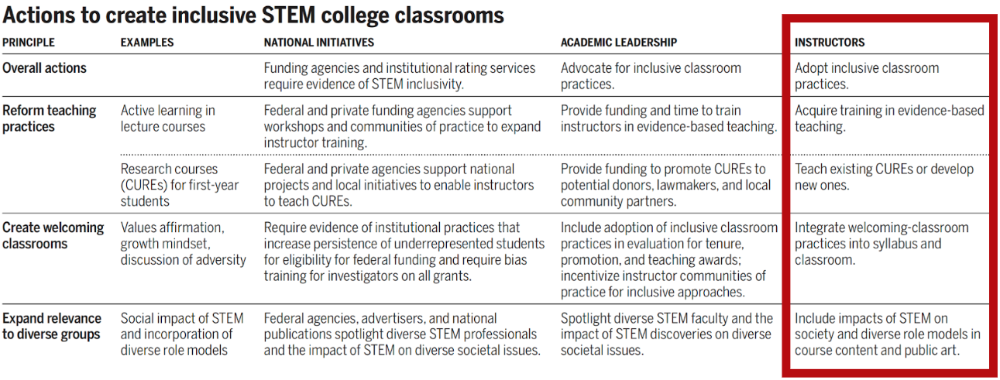
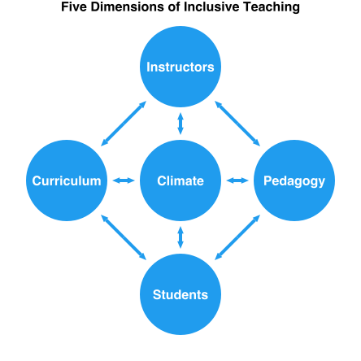
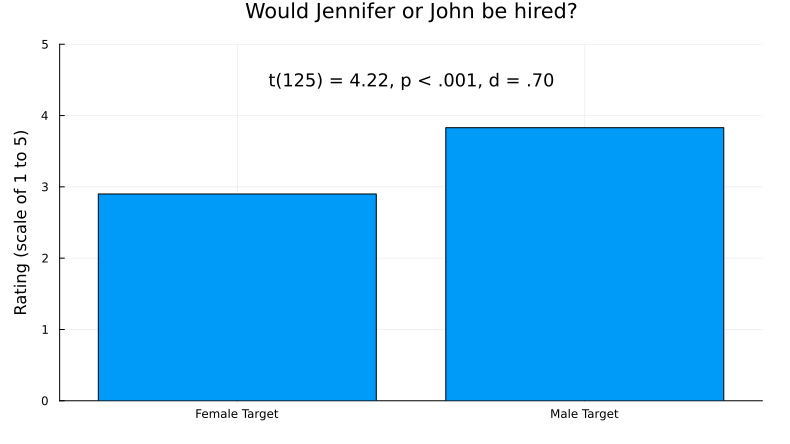
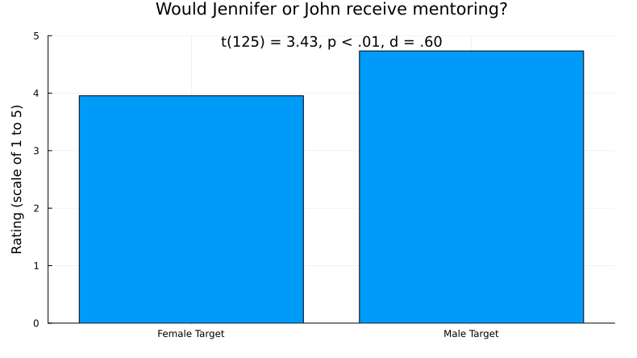
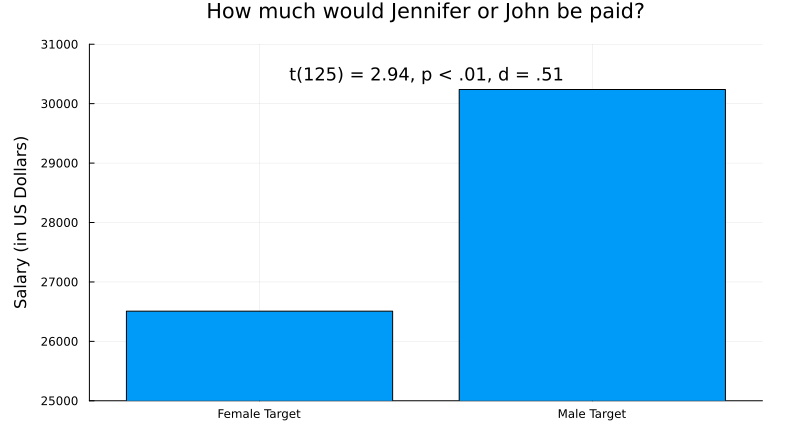
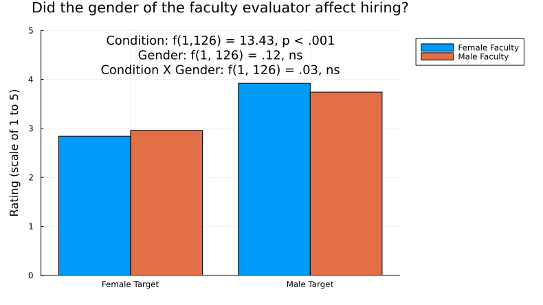

# Inclusive Learning

!!! warning ""
    This site is still under development. Thank you for previewing it! Your feedback is much appreciated -- [Let us know what you think!](https://uwmadison.co1.qualtrics.com/jfe/form/SV_eaCduZfaBtfNpRA)

```@raw html
<!-- TODO insert vignette videos from Sarah K here -->
```

---
## Module Goals

In this module, we hope you will...

- Commit to one action you could take toward sharing your identity in your course. 
- Commit to one action you could take to mitigate the negative impacts of biases and assumptions in your course. 
- Commit to one action you could take to mitigate the negative impacts of stereotype threat in your course. 
- Commit to one discrete and one systemic action you could take to promote a positive sense of belonging in your course.
- Commit to one action you could take to ensure students engage in the facets of science.
- Commit to one action you could take to create a productive failure experience in your course. 

---
## Inclusive Learning Defined

!!! compat ""
    `NOTE: This content was restructured recentlys. Its objectives need to be rewritten.`

Inclusive learning encompasses the strategies, structure and climate of a learning environment. An inclusive learning environment is one in which students feel a sense of belonging, value, and respect, and are provided with the necessary resources and opportunities to actively learn.

---
## Why Inclusive Learning

!!! compat ""        
    - Explain why inclusive learning environments matter.
    - Identify actions an instructor can take to create inclusive learning environments.
    - Understand key concepts and principles:
        - Inclusive learning environments lead to persistence and diversity in STEM.
        - Inclusive learning environments come from inclusive teaching practices.

Diversity in STEM starts with inclusive learning environments. There is no shortage of proven inclusive teaching methods; in fact the number of choices can be overwhelming. Moreover, who we are as people also influences the learning environment. 

This module provides a supplement to the many examples woven into the rest of the Scientific Teaching Course. It distills several key evidence-based practices, contextualizes them for college STEM courses, and gives you the chance to evaluate how to apply them in your course. You will also explore your identity, biases, and assumptions and consider how they influence who feels included or excluded in your course.

```@raw html
<!-- 
### Achieve STEM diversity: Fix the Classrooms, Focus on what instructors can do

`TODO maybe just make the table in text directly?`

`TODO add a distillation sentence`



Image source: [handelsman_achieving_2022](@cite)
-->
```

---
## A Framework for Inclusive Learning

!!! compat ""    
    `NOTE: This content was restructured recentlys. Its objectives need to be rewritten.`



Figure adapted from [bell2016design,marchesani1992dynamics](@cite).

Recall the five dimensions to inclusive teaching:

- **Who we are:** Be aware of how our social, emotional, and pedagogical perspectives shape how we teach.
- **Who we teach:** Plan meaningful interactions when we are aware of the many dimensions of our students.
- **What we teach:** Choose diverse content, perspectives and contexts with students’ needs and backgrounds in mind.  
- **How we teach:** Impact learning by implementing evidence-based teaching practices and creating engaging activities with aligned assessments. 
- **And how the class is designed:** Create an environment that enriches student learning through supportive structure and peer connections.

Awareness of students helps to develop learning goals and teaching approaches and can help us to plan for meaningful interactions. And awareness of self can shape how we teach and help us to be aware of areas for growth.

---
## Inclusive Learning in Practice

### Share Your Identity

!!! compat ""    
    - Examine your identities.
    - Predict how instructor identities influence student outcomes.
    - Decide which identities to share.
    - Understand key concepts and principles:
        - Your identity influences the classroom learning environment.
        - The first step is to be aware of them.

```@raw html
<!-- `TODO wheres the data?` -->
```

Your identity matters. Consider the identities that you bring to the learning environment and how they influence your perspectives and the learning environment.

!!! note ""
    #### Reflect on Your Identities

    What identities do you bring to the learning experiences and interactions within that course?

    Write down, on a separate piece of paper for privacy, your:

    - Full name
    - Race
    - Ethnicity
    - Gender identity and sexual orientation
    - Veteran status
    - Educational path
    - Family’s socioeconomic status
    - Health (mental and physical)
    - Family situation and/or relationship status
    - Circle of friends
    - Hobbies or interests
    - Financial situation

    Do you tell your students these attributes? Why or why not?

    Do you think your students’ attributes are similar to yours? How could you find out?

    How do you think these attributes influence your perspectives about student learning and who is or isn’t included in learning?

!!! tip ""
    #### Commit to Action: Identity

    *Answer in your workbook:* What is one concrete action you could take toward sharing more about your own identity in your courses?

### Address Biases and Assumptions

!!! compat ""    
    - Examine your biases and assumptions.
    - Predict how biases and assumptions influence student outcomes.
    - Commit to one action you could take to mitigate the negative impacts of biases and assumptions in your course.
    - Understand key concepts and principles:
        - Biases and assumptions influence the classroom learning environment.
        - We all hold biases and assumptions.
        - Biases and assumptions are very difficult to change, but the first step is to be aware of them.

Everyone holds biases, assumptions, and stereotypes about others, which can influence outcomes. For example, biases and assumptions affect how we rate people, which can have consequences for hiring decisions and advancement.

!!! note ""
    #### Hiring Studies

    In one study, $127$ biologists, chemists, and physicists at six top US research universities received a student resume that was randomly assigned a gendered name: “Jennifer” (female) or “John” (male). Otherwise, the applications were identical, and each evaluator saw only one version of it. Evaluators then reviewed the credentials of the applicant and decided whether to hire or not.

    The researchers asked the scientists questions about the student candidate:

    - Would you hire them as a lab manager?
    - Do they seem competent?
    - Do you see potential for mentoring?
    - What salary would you offer?

    What results would you predict for that study?

    How do you think the gender, field, age, or tenure status of faculty making hiring decisions mattered?

    !!! details "Click here to find out what happened!"

        How do the results below match your predictions?

        ```@setup jennjohn
        using StatsPlots
        size = (790, 444)
        p = plot(title="Would Jennifer or John be hired?", size=size, margin=5Plots.mm, ylabel="Rating (scale of 1 to 5)", ylims=(0,5))
        plot!(p, ["Female Target", "Male Target"], [2.9, 3.83], seriestype=:bar, label=nothing)
        annotate!(p, 1, 4.5, text("t(125) = 4.22, p < .001, d = .70", :center, :black, 12))
        savefig(p, "assets/would-jennifer-or-john-be-hired.svg")

        p = plot(title="Would Jennifer or John receive mentoring?", size=size, margin=5Plots.mm, ylabel="Rating (scale of 1 to 5)", ylims=(0,5))
        plot!(p, ["Female Target", "Male Target"], [3.955, 4.735], seriestype=:bar, label=nothing)
        annotate!(p, 1, 4.9, text("t(125) = 3.43, p < .01, d = .60", :center, :black, 12))
        savefig(p, "assets/would-jennifer-or-john-receive-mentoring.svg")

        p = plot(title="How much would Jennifer or John be paid?", size=size, margin=5Plots.mm, ylabel="Salary (in US Dollars)", ylims=(25000,31000), yformatter=:plain)
        plot!(p, ["Female Target", "Male Target"], [26507.94, 30238.10], seriestype=:bar, label=nothing)
        annotate!(p, 1, 30500, text("t(125) = 2.94, p < .01, d = .51", :center, :black, 12))
        savefig(p, "assets/how-much-would-jennifer-or-john-be-paid.svg")

        p = plot(title="Did the gender of the faculty evaluator affect hiring?", size=size, margin=5Plots.mm, ylabel="Rating (scale of 1 to 5)", ylims=(0,5), legend=:outertopright)
        groupedbar!(p,
            ["Female Target", "Female Target", "Male Target", "Male Target"],
            [2.84, 2.96, 3.92, 3.74],
            group=["Female Faculty", "Male Faculty", "Female Faculty", "Male Faculty"]
        )
        annotate!(p, 1, 4.8, text("Condition: f(1,126) = 13.43, p < .001", :center, :black, 12))
        annotate!(p, 1, 4.5, text("Gender: f(1, 126) = .12, ns", :center, :black, 12))
        annotate!(p, 1, 4.2, text("Condition X Gender: f(1, 126) = .03, ns", :center, :black, 12))
        savefig(p, "assets/did-the-gender-of-the-faculty-affect-hiring.svg")
        ```

        

        

        

        

        From the paper:

        > Faculty gender did not affect bias. Tests of simple effects (all $d < 0.33$) indicated that female faculty participants did not rate the female student as more competent [$t(62) = 0.06$, $P = 0.95$] or hireable [$t(62) = 0.41$, $P = 0.69$] than did male faculty. Female faculty also did not offer more mentoring [$t(62) = 0.29$, $P = 0.77$] or a higher salary [$t(61) = 1.14$, $P = 0.26$] to the female student than did their male colleagues. In addition, faculty participants’ scientific field, age, and tenure status had no effect (all $P > 0.53$). Thus, the bias appears pervasive among faculty and is not limited to a certain demographic subgroup [Moss-Racusin2012-cm](@cite).

        Image source: [Moss-Racusin2012-cm](@cite)

### Reactions to evidence of bias

But you’re a scientist, so you’re not biased, right?

When confronted with the idea that scientists are biased, we have heard:

- “Women and minorities are just too sensitive.”
- “It’s not like that here. Probably it’s like that elsewhere…in Sweden, in the Midwest, at Harvard, at the state university, at the community college, in the Economics Department…”
- “The sample size for Table 3 of the 1988 study was too small.”
- “We’re trained to be objective, so bias studies don’t apply to us.”

Yet study after study demonstrates that we *all* carry biases, assumptions, and stereotypes. 

### Assumptions Matter

```@raw html
<!-- `TODO are there citations for this?` -->
```

Everyone holds biases, assumptions, and stereotypes about others, which can influence outcomes in college or for hiring decisions and advancement.

**Rating Verbal Skills:**

When reviewers evaluated a candidate’s written text, their ratings of the candidate’s verbal skills were influenced by the author’s demographics. For example, when reviewers were informed that an African American person had written the text, they rated the candidate’s verbal skills lower compared to when they were told a white person had written it. Similarly, when reviewers were told that a man wrote the text, they evaluated the candidate’s skills more negatively than when they were told a woman wrote it.

**More Hiring Studies:**

Dozens of studies have compared hiring decisions with the same setup…

- Identical applications with a male or female name.
- Evaluators review the applicant’s credentials and decide whether or not to hire them. 

…and they all yield the same result: Evaluators are substantially more likely to hire if an applicant has a man’s name.

**This result has not changed for $50$ years.**

Beyond gender: Studies with members of groups other than white, heterosexual, cis-gendered, able-bodied men yield similar results.

!!! note ""
    #### Reflection on Bias in STEM

    What other biases have you seen or experienced in STEM higher education? 

### Actions to Mitigate Bias

```@raw html
<!-- `TODO wheres the data?` -->
```

Awareness:

- **Catch yourself:** Whose answers do you dismiss or talk over? When a woman or person of color responds, what initial reaction do you have to their point of view?
- **Collect data:** How often do you call on the students in the front row? Which demographic groups tend to get the highest grades? Which students do you give constructive feedback?
- **Catch others:** When do they dismiss or talk over someone?

Actions:

- **Call out:** When someone dismisses another, use your voice to return the conversation to the dismissed person. “Jasmine has a point. I’d like to hear more.” “You are restating what Amir said.” 
- **Be an ally:** Complete [Safe Zone training](https://thesafezoneproject.com/learn/) and put a Safe Zone sticker on your office door. Add an statement about bias and assumptions to your syllabus. Use preferred pronouns and gender-neutral pronouns. 
- **Grade fairly:** Remove subjectivity in grading due to bias by using a fixed grading scale that makes clear which competencies warrant which grades.

Set a tone for your class and reinforce it:

- **Signal expectations and values:** “In this class, everyone’s voice matters.”
- **Find out more:** Ask students what they need and want. 
- **Equip students:** Provide them with the language and tools they need to mitigate bias.
- **Check in:** Do a “bias check” every month. “Have you seen an act of bias or assumptions in this class with negative repercussions? Was it resolved? What needs to be addressed?” Act on the requests.

!!! tip ""
    #### Commit to Action: Mitigate Bias

    *Answer in your workbook:* What is one concrete action you can commit to taking to mitigate the negative impacts of biases and assumptions in your course?

### Mitigate stereotype threat

!!! compat ""    
    - Examine how your course might activate stereotype threat.
    - Predict how stereotypes influence student outcomes.
    - Commit to one action you could take to mitigate the negative impacts of stereotype   threat in your course.
    - Understand key concepts and principles:
        - Stereotype threat influences the classroom learning environment.
        - We all hold stereotypes.
        - Stereotypes are very difficult to change, but the first step is to be aware of them.

Biases and assumptions can manifest as stereotypes. When those stereotypes are activated, it can result in a phenomenon called **stereotype threat**, in which people fear they may confirm negative stereotypes about their social group. This fear can negatively affect their performance and reinforce the stereotype – regardless of their actual capabilities – thereby creating a self-fulfilling prophecy. 

Stereotype threat can result from negative stereotypes against any aspect of one’s identity, such as ethnicity, culture, first-generation status, veteran status, and sexual orientation. It can negatively affect academic performance and persistence in STEM.

**The simple act of mentioning a stereotype can activate threat and lead to negative outcomes** [Kumar2010-mp,Stricker2015-ce,Steele2002-pt,Steele1995-bz](@cite).

### Stereotype Threat Examples

- When Black students were told that a verbal section of the Graduate Record Exam (GRE) was diagnostic of intellectual ability, they would perform worse than white students. **They performed equally well when the test was not labeled diagnostic of intellectual ability.**
- Students of lower socioeconomic backgrounds underperformed on the same GRE section when compared to students from more affluent backgrounds when financial status was mentioned. **They performed the same when affluence was not mentioned.**
- Women performed worse than men when a math test was described as producing gender differences. **When the test was described as not producing gender differences, women and men performed equally well.**

!!! tip ""
    #### Commit to Action: Mitigage Stereotype Threat

    *Answer in your workbook:* What is one concrete action you can commit to taking to mitigate the negative impacts of stereotype threat in your course?

### Create a sense of belonging in STEM

!!! compat ""    
    - Examine how your course might create or preclude a sense of belonging.
    - Predict how belonging influences student outcomes.
    - Commit to one discrete and one systemic action you could take to promote a positive sense of belonging in your course.
    - Understand key concepts and principles:
        - The classroom learning environment influences the extent to which student feel a sense of belonging.
        - Belonging affects outcomes and persistence in STEM.

Historically excluded communities (HECs) refer to groups of individuals who have traditionally been denied full rights, privileges, and opportunities in STEM education, including women, people of color, caregivers, LGBTQIA+ students, first-generation students, and low-income students. These groups have traditionally been underrepresented or excluded from participating in STEM. See also [Asai2020-bb](@cite).

The differential pattern of exclusion from STEM affects students not only according to race and ethnicity; talented college students from HECs leave at higher rates [thiry_talking_2019](@cite). 

Most of those who leave have the interest, confidence, and aptitude to be successful in STEM, but early classroom experiences can dampen their interest and actively exclude them from persisting [thiry_talking_2019,estrada_influence_2019](@cite).

Their departures after gateway STEM courses represent a major talent drain from the system. 

To achieve an equitable educational enterprise, we must address the structural, individual, intentional, and unintentional biases that discourage HEC students from pursuing STEM.

### Actions to foster belonging in STEM

Several interventions have demonstrated promise in increasing college students’ persistence in STEM [estrada_toward_2011](@cite). These interventions often have especially positive effects on students who belong to communities that have been historically excluded from STEM [evans_functional_2021,hurtado_diversifying_2009,olson_expression-based_2019,rodenbusch_early_2016,shuster_implementing_2019,waddell_flying_2021](@cite).

```@raw html
<!-- `TODO use full sentence for these bullet points` -->
```

**Discrete interventions** are defined as individual activities embedded within a course. Example interventions that have been shown to lead to positive student outcomes include:

- Active-learning strategies [freeman_active_2014](@cite)
- Statements that increase students’ sense of belonging with microaffirmations [estrada_influence_2019](@cite)
- Activities that increase resilience by reframing social adversity as common and transient [walton_brief_2011](@cite)
- Exercises that demonstrate the relevance of a course by making explicit its utility value [harackiewicz_closing_2016](@cite) (Asher et al., 2023; Harackiewicz et al., 2016).

**Systemic interventions** modify overall course structure. Some approaches that have proven effective include:

- High-structure course design [freeman_increased_2011,theobald_active_2020](@cite)
- Course-based undergraduate research experiences (CUREs) [aikens_race_2017,dolan_guide_2021,hurtado_diversifying_2009](@cite)

### A framework to gauge belonging

The Tripartite Integration Model of Social Influence (TIMSI) provides a framework for understanding the psychological mechanisms linking educational experiences and persistence outcomes [estrada_toward_2011](@cite). The TIMSI describes three orientations that predict persistence in STEM. 

- **Scientific self-efficacy** indicates that a student feels capable of performing the actions needed to be successful in a STEM course, major, or career. 
- **Scientific identity** indicates that a student perceives science as part of their identity and feel they belong to a scientific community. 
- **Students internalize scientific values** when they authentically agree with the values of the scientific community, such as building new knowledge to solve global challenges, the thrill of discovery, and the importance of discourse.

According to the TIMSI, each of these three factors — independently and collectively — contribute to social integration into STEM communities. Social integration (or persistence) is defined as the intent to pursue further academic or career goals in STEM, or as behaviors, such as submitting applications for graduate school.

### Getting to Know Your Students

```@raw html
<!-- `TODO wheres the data?` -->
```

Who are your students? Who feels like they belong in your class or in STEM? How can you find out?
    
You might have students…

- Fill out anonymous surveys before, during, and at the end of the course with questions about scientific self-efficacy, identity, values orientation, and persistence intentions. Compare results across the semester.
- Bring an item to class that represents how they see themselves with respect to science and discovery. 
- Find an image online that represents what they want to get out of your course.
- Share one thing science-related fact about their lives (favorite science fact, most science-y hobby, why they are interested in science).

!!! tip ""
    #### Commit to Action: Promote Belonging

    *Answer in your workbook:* What is one discrete and one systemic action you can commit to taking to promote a positive sense of belonging in your course?

### Connect Facets of Science with Inclusive Learning

!!! compat ""    
    - Examine how your course provides students with access to the facets of science.
    - Predict how experiencing the facets of science influences student outcomes.
    - Commit to one action you could take to ensure students engage in the facets of science. 
    - Understand key concepts and principles
        - The facets of science provide a framework for engaging students in learning science authentically.
        - Students who engage in authentic science practices are more likely to persist in STEM.
        - Just one CURE in college can increase persistence in STEM.

When students actively participate in the facets of science, we see:

- Improved scientific self-identity and efficacy
- Increased belonging
- Persistence in STEM degrees and careers
- Increased STEM accessibility for students with health conditions or impairments

Positive gains for all students with additional gains for students who are members of HEC groups.

These outcomes lead to diversity in the STEM workforce and and informed citizenry.

Source: [estrada_toward_2011](@cite).

### One Example: CUREs

Course-based Undergraduate Research Experiences (CUREs) increase:

- Research skills and project ownership
- Confidence, self-efficacy, and belonging in STEM
- Retention in STEM

CUREs normalize failure by:

- Teaching about scientific failures
- Showing how to troubleshoot experiments
- Creating opportunities to share personal failures with colleagues

**Just one CURE in college can increase persistence in STEM**

!!! tip ""
    #### Commit to Action: Engage the Facets of Science

    *Answer in your workbook:* Even if you don’t teach a CURE, what is one concrete action you can commit to taking to ensure students engage with the facets of science?

### Create Productive Failure Experiences

!!! compat ""    
    - Examine where students implicitly or explicitly learn about failure in your course.
    - Predict how experiencing personal or scientific failure influences student outcomes.
    - Commit to one action you could take to create a productive failure experience in your course. 
    - Understand key concepts and principles:
        - Science and discovery are based on failure.
        - Failure can be personal or scientific.
        - Learning how to fail productively may lead to positive student outcomes.

Science is based on failure:

- All engineering innovation is predicated on failed designs (Petroski 2006).
- Failure is an expected and necessary part of learning and scientific inquiry [simpson_failure_2017](@cite).
- Failure in science can lead to learning to iterate and solve problems (Lopatto et al., 2020; Gin, et al., 2018).

Yet students may not think failure is productive:

- Students conclude that classroom struggles indicate they are not cut out for science (Good et al., 2012; Koch et al., 2008).
- Fear of failure— “cognitive and emotional reaction towards environmental stimuli that are apprehended as threats in achievement contexts” (Cacciotti, 2015).
- Fear is antithetical to learning and creativity.
 
### Growth mindset opportunity!

Reframe how you and your students think about the role of failure:

- Instead of: *My experiment failed. I am a failure.*
- Move toward: *What went wrong? How can I change it next time? What can I learn from it?*

### Help students perceive failure as productive

- Hearing only about physicists’ achievements diminished students’ interest in science; learning about their struggles enhanced students’ interest in and recall of key concepts from the course. (Hong & Lin-Siegler, 2012). 
- “Struggle stories” increased student motivation and performance, especially among low-performing students [lin-siegler_even_2016](@cite). 
- The “growth mindset” enables students to see a failure as an opportunity for growth rather than an assurance of further failure. (Dweck, 2006; Good et al., 2012; Canning, XX)

### Failure in STEM

```@raw html
<!-- TODO update the framing of this framework as the failure study progresses -->
```

Failure is essential part of science, yet it, along with resilience, are not explicitly taught. There are two types of failure: personal and scientific. A framework can provide a path for engaging students in failing productively and developing resilience.

Productive Failure Framework:

Personal failure results from:

- Life circumstances
- Personal choices
- Challenging or impossible tasks
- Insufficient effort, practice, or training

Scientific failure results from:

- Technical issues in an experiment
- Data not supporting a hypothesis
- Idea not being accepted by peers

!!! note ""
    #### Reflect on Failure

    Think about where students implicitly or explicitly learn about failure in your course, and identify ways they can experience productive failure.

    Do students learn how to navigate personal failures and if so, how? 

    What productive failure opportunities could be included in your course to mitigate negative outcomes related to personal failure?

    Do students learn how to navigate scientific failures and if so, how? 

    What productive failure opportunities could be included in your course to mitigate negative outcomes related to scientific failure?

!!! tip ""
    #### Commit to Action: Experience Productive Failure

    *Answer in your workbook:* What is one concrete action you can commit to taking to create a productive failure experience in your course, or ensuring that students experience their failures in your course as productive?

---
## An AJEDI lexicon for inclusive learning

!!! compat ""    
    - Know the relevant terms for inclusive learning.
    - Understand key concepts and principles:
        - AJEDI = antiracism, justice, equity, diversity, and inclusion

**Antiracism:** Active efforts to reduce racism that are embodied in behaviors, actions, and policies that lead to racial equity and are substantiated by antiracist ideas. Practicing antiracism requires constantly identifying, challenging, and replacing existing racist acts and policies to foster equity between racial groups.

**Justice:** A concept of fair and just relations between the individual and society. It involves ensuring that power, wealth, education, healthcare, and other opportunities are distributed fairly among individuals regardless of their background. It also means treating people of all races fairly, so that everyone has the same chances and outcomes. Achieving racial justice requires putting systems and measures in place that actively work towards equal treatment and opportunities for people of all races.

**Equity:** The condition in which individuals are provided the resources they need to have access to the same opportunities as the general population. Equity accounts for systematic inequalities, meaning the distribution of resources provides more for those who need them most.

**Diversity:** The myriad of ways in which people differ, including the psychological, physical, cognitive, and social differences that occur among all individuals, such as race, ethnicity, nationality, socioeconomic status, religion, education, age, gender, sexual orientation, marital status, mental and physical ability, immigration status, and learning preferences. Diversity is all-inclusive and supportive of the proposition that everyone and every group should be valued.

**Inclusion:** Authentically bringing traditionally excluded individuals or groups into processes, activities, and decision- and policy-making in a manner that shares power.

[lawrence2004structural,miller_ajedi_2022](@cite)
