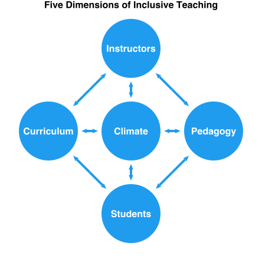

# Scientific Teaching

`TODO insert vignette videos from Sarah K here`

```@raw html
<!-- Temporary: hide TODO comments for Symposium review -->
<style>
    pre, code {display: none}
</style>
```

## Module Goals

By taking this module, we hope you will be able to...

- Define scientific teaching and its goals.
- Explain how scientific teaching supports students in learning the facets of science.
- Examine why diversity matters in science.
- Begin applying scientific teaching to your own teaching and course(s).

### Submodule Objectives

**Scientific Teaching Defined:**

- Define scientific teaching.
- Articulate the goals of scientific teaching.
- Understand key concepts and principles:
    - Scientific teaching is both the teaching of science and the science of teaching.
    - The goals of scientific teaching are to make teaching and learning more scientific and increase diversity in STEM.
    - Scientific teaching means being intentional, inclusive, and iterative.

**Why Scientific Teaching:**

`TODO we still need to address the use of "good" and whether we are going to select a different word`

- Explain why scientific teaching leads to good science education, good science, and good teaching
- Examine how various courses (including your own) uphold scientific teaching.
- Commit to one change in your course to uphold scientific teaching principles.
- Understand key concepts and principles:
    - Good science education means equitable science education.
    - Good science is inclusive science.
    - Good teaching is intentional, inclusive, and iterative.

*Good Science Education:*

- Identify barriers to good science education around the world.
- List recommendations to improve science education in your country.
- Commit to one systemic recommendation for improving diversity in STEM.
- Commit to one discrete action you could take to improve how science is taught in your own course.
- Understand key concepts and principles:
    - Poor teaching methods are the main reason college students switch out of STEM majors.
    - Myriad reports call for changes in teaching practices to foster inclusive learning environments.
    - STEM education reform can happen at many levels. As an instructor, you have agency for change in your courses.

*Good Science:*

- Explain why it is important for students to learn the facets of science.
- Examine how your current course schedule engages students in the facets of science.
- Commit to the facets of science you want your future course schedule to embody.
- Understand key concepts and principles:
    - The facets of science include much more than the facts of science.
    - The facets of science include thinking like a scientist, using the tools of a scientist, and communicating like a scientist.
    - Students who engage in authentic science practices are more likely to persist in STEM.

*Good Teaching:*

- Identify what aspects of teaching science are personally motivating for you.
- Reconsider how you think of the course material and the role of instructors and students in the course.
- Connect good science teaching with intentional course design, inclusive learning, and iterative approaches.
- Understand key concepts and principles:
    - Good teaching moves away from the instructor covering content toward the student learning science.
    - Change can be achieved at many levels. The STC focuses on what instructors have agency to change: the classroom.
    - Good teaching is intentional, inclusive, and iterative.

**A Framework for Scientific Teaching:**

- Examine the parallels between your scientific research and your teaching approaches.
- Commit to one action you could take to address each of the five dimensions of diversity and equity in your course.
- Understand key concepts and principles:
    - Good teaching embodies five dimensions of diversity and equity: students, instructors, curriculum, pedagogy, and the classroom climate and group dynamics.
    - These dimensions can work together to create a cohesive learning experience.
    - Instructors do not need to be educational experts to be good teachers, but it helps to use methods that are (1) based on solid theory, (2) tested and evaluated in the classroom, and (3) organized by a logical framework.

**Scientific Teaching in Practice:**

- Describe how scientific teaching leverages the facets of science for students for learning and for instructors while teaching.
- Commit to one action you could take to put scientific teaching in practice with respect to students learning science and for you, the instructor, teaching science.
- Understand key concepts and principles:
    - Scientific teaching offers a natural structure for teaching that parallels our scientific research, as well as the scientific practices we are asking our students to learn.
    - The STC focuses on what instructors have agency to change: The classroom.

**Lexicon of Scientific Teaching:**

- Know the definitions of terms used in STC
- Understand key concepts and principles:
    - Words used in scientific teaching support a common, shared understanding.

## Scientific Teaching Defined

Scientific teaching is both the *teaching of science* and the *science of teaching*. An instructor who practices scientific teaching:

- Engages students in authentic practices of science
- Approaches their teaching with the spirit of scientific research.

Scientific teaching combines intentional decisions with iterative improvements to create inclusive learning experiences, which, in turn, support students learning science.

**Scientific teaching is intentional, inclusive, and iterative.**

### Goals of Scientific Teaching

**The goals of scientific teaching are to make teaching and learning more scientific and to increase diversity in STEM.**

Embedded in this undertaking is the challenge to all scientists to bring to teaching the critical thinking, rigor, creativity, and spirit of experimentation that defines research. Scientific teaching also posits that teaching science should capture the spirit of discovery in the classroom in ways that are accessible to all students. As you will see, there is ample evidence that teaching scientifically improves undergraduate education, accessibility, and student learning. This body of evidence can inform instructional decisions.

The Scientific Teaching Course (STC) provides an overview of the complex and expansive landscape of evidence, approaches, methods, and theories. It also highlights the role of systemic barriers in learning environments and provides tools to remove them.

**Our aim is to empower you, the instructor, to customize the approaches for your own identities, students, content, and contexts.**

The STC brings scientific teaching to life: This course is organized around interactive modules that provide guidelines, reflective moments, hands-on practice, and immediate application.

The modules build on and reinforce each other:

- **Scientific Teaching** explains why change is needed and lays a foundation of evidence-based theories.
- **Inclusive Learning** and **How Learning Works** permeates the entire course.
- **Course Design**, **Learning Experiences**, **Summative Assessment**, and **Course Structure** turn theory into actionable practice.
- **Scientific Teaching Revisited** offers a framework for lifelong learning and iterative improvement.

[handelsman_scientific_2004](@cite)

## Why Scientific Teaching?

`TODO distillation sentence / paragraph for this submodule`

### Good Science Education

**Good science education is equitable science education.**

```
TODO From Becca:

I'm not quite convinced of the framing of opportunity gaps (see Shukla et al 2022,
https://www.lifescied.org/doi/full/10.1187/cbe.21-05-0130). It's still framing comparisons
around a white male control group...
```


Scientific teaching is needed because inequities plague higher education and affect STEM workforce diversity.

Increasing diversity in STEM requires drawing on a larger talent pool that includes the many historically excluded groups of people. Diversity of the future workforce should match the demographics of the world’s citizens, take advantage of underutilized talent in all demographic groups, and make STEM careers readily available to people of all backgrounds.

Yet inequities continue to plague college science education, denying opportunities to students who identify as members of underrepresented racial or ethnic minorities, women, LGBTQIA+, or first-generation in college. Collectively, we refer to these and other underrepresented groups as historically excluded communities (HECs).

To achieve an equitable educational enterprise, we must address the structural, individual, intentional, and unintentional biases that discourage HEC students from pursuing STEM.

`TODO what are the full citation used in the below sentence?`

Opportunity gaps between overrepresented and underrepresented students have been called “one of the most urgent and intractable problems in higher education” (Theobald et al., 2022, Bensimon 2005).

### What the US Reports Say about STEM Education

Most US science is taught as lectures that are dominated by facts rather than principles and ways of thinking [stains_anatomy_2018](@cite). Sadly, substantial evidence shows that lecturing alone is a relatively ineffective way of teaching, and retention from lectures is poor. But report after report shows there are better ways to teach science, to teach scientifically, and that these approaches also serve to make science education more equitable:

`TODO what are the full citations used in the points below?`

-  In *Science for All*, the American Association for the Advancement of Science (1989) called for a scientifically literate public and charged higher educators with teaching scientific habits of mind. They noted that employers were demanding more efficient and effective employees with problem-solving capabilities, the ability to work in teams, and analytical skills, yet students were unprepared for these demands.
- In 2003, the National Research Council published *Bio2010*, a report recommending that curriculum better reflect the nature of science as a dynamic, interdisciplinary, and rapidly changing frontier.
- *Vision and Change* (2008) connected science goals with faculty development practices, and called for more research in STEM higher education.
- *Engage to Excel* (2012) purported that improving undergraduate STEM education to address these weaknesses is a national imperative to address STEM workforce shortages.
- A consensus report from the National Academies on undergraduate STEM education (2018) identified that improving the quality and impact of undergraduate STEM education requires progress on three goals [dibner2018indicators](@cite):
    1. Increase students’ competence in STEM concepts and skills by engaging them in evidence-based STEM educational practices and programs.
    2. Strive for equity, diversity, and inclusion of STEM students and instructors by providing equitable opportunities for access and success.
    3. Ensure adequate numbers of STEM professionals by increasing completion of STEM credentials as needed in the different disciplines.

### What the International Reports Say

The problems of exclusion and a lack of a diverse, prepared workforce is not unique to the United States. International reports echo the American reports:

`TODO what are the full citations used in the paragraphs below?`

In **India**, the Annual Status of Education Report (ASER 2022) found serious structural inequities with respect to college STEM. Only 18% of schools had a functional computer lab. More than 9% STEM instructor positions were vacant, reaching 25% in some regions. Outdated teaching methods, lack of computing infrastructure, and resource deficits worsen the situation, especially in rural areas. The report recommends a focus on resources to support quality STEM education around critical thinking, multidisciplinary learning, and strong foundations in scientific discovery. It aims to prepare over 250 million young Indians across socioeconomic backgrounds for 21st century jobs and equip them to solve complex real-world problems through technology.

**Africa** perhaps has the most opportunity to grow regarding STEM education. A 2020 UN report showed that only 21.7% of African STEM students graduate, compared with 24.3% in Europe and Central Asia, and 25.6% in the USA. Africa's education training programs suffer from inequalities and exclusion at all levels: education expenditures, inadequate teacher development programs, limited access to electricity and internet, and inadequate infrastructure for STEM teaching and learning. The challenges will be not only to improve science curriculum through evidence-based practices, but also to secure the basic resources needed to support instructors and colleges.

In a recent (2022-23) report on Diversity and Inclusion in STEM, the **UK** government identified several structural inequities, calling for raising levels of diversity and inclusion in STEM education, while also mentioning the importance of measuring change.

### STEM has an Equity Problem in US Higher Education

Underrepresentation in STEM is primarily due to attrition in the US. Who switches out of STEM?

- 42% of white students
- 58% of Latine students
- 66% of Black students

More than half of the ~600,000 US college students who intend to major in STEM switch to other fields.

Why? In extensive interviews of college students enrolled in STEM majors, 90% complained about poor teaching methods.

### Discriminatory Practices in STEM Education

We believe it is crucial to integrate inclusive principles into educational spaces in order to create inclusive and equitable learning environments for all students. The U.S. education system currently and historically uses racist and discriminatory practices to prevent certain communities from having access to and benefiting from the best possible education.

```
TODO from Cara:

This slide feels K-12y to me. Is that what this is based on? If the purpose of the slide is to establish
"we have a problem" I wonder if it would be more valuable to cite research for why students are leaving
STEM in college - building on the previous slide - because it might feel more relevant to our audience
and more immediately actionable.

shifting it in this way would also better align with this key concept from earlier slide: Poor teaching
methods are the main reason college students switch out of STEM majors.
```

Example discriminatory practices:

- **Disparities in funding:** Schools with mostly white, affluent students receive more funding compared to schools in low-income areas and schools with predominantly students of color.
- **Lack of diversity in curriculum:** The curriculum in many schools and universities perpetuates the achievements and culture of white people while neglecting the contributions of diverse cultures and people of color.
- **Discipline disparities:** Students of color are more likely to receive harsher disciplinary punishments while their white counterparts receive lighter sanctions for the same offenses.
- **Racial profiling and stereotyping:** Students of color are more likely to be labeled as "troubled," "aggressive," or "unintelligent" based on their appearance and behavior, leading to disparate experiences in the education system.
- **Unequal access to resources and opportunities:** Students of color have less access to resources such as books and technology as well as research opportunities.

### What We Can Do

`TODO streamline this`


Source: [handelsman_achieving_2022](@cite)

We need more:

- Scientists in the workforce to solve global and local problems
- Diversity in the STEM workforce to inform what problems are important and to come up with creative solutions
- Scientifically literate citizens to make informed decisions

Change can be achieved at many levels. Policy decisions can be improved when policy-makers and voters understand how scientific knowledge is derived and what findings have been discovered.

**The STC focuses on what instructors have agency to change: the classroom.**

!!! note "What do your country’s reports recommend?"

    Find one or more reports from your country. What STEM education inequities plague your country?

!!! warning "Workbook"

    Complete Activity TK in your workbook: Commit to:

    - One systemic recommendation for improving diversity in STEM.
    - One discrete action you could take to improve how science is taught in your own course.

### Good Science

Good science is inclusive science.

**Scientific teaching is needed because science is important:**

The rapid expansion of many scientific frontiers places the onus on science educators to teach efficiently and effectively, assuring that students engage with a vast amount of knowledge, learn how to interact with and evaluate it, and retain much of it. Whether they major in biology, art history, math, or elementary education, no one should not complete a college education without understanding basic principles and facts about the world around them. Equally important, our students need to emerge with an understanding of the facets of science so they can appreciate the origins of scientific information, think critically about new problems and situations, and sustain a lifelong curiosity about the world around them. The need to solve global problems and navigate the difference between evidence-based claims and opinions is becoming increasingly important.

**Scientific teaching is needed because diversity is important to science:**

Teaching science in a way that reflects how science is done can broaden participation in STEM. When students actively engage in authentic scientific practices, they develop a more robust scientific self-efficacy and identity [estrada_toward_2011](@cite). When students witness diverse scientist identities and engage in real-world problems, it allows a broader range of students to connect with and envision themselves as part of the scientific community. These factors – positive self-efficacy, identity, and connection with scientific values – lead to increased persistence in STEM, especially for students from communities that have been historically excluded [estrada_toward_2011](@cite). Broadening participation in STEM is essential for asking meaningful questions, addressing inequities, and ensuring that STEM benefits everyone.

### The Facets of Science

```@setup fivedims
using Luxor

let # local scope
    @svg begin
        # Set font
        fontface("Helvetica-Bold")

        # Plot title
        top = Point(0, -220)
        fontsize(16)
        setcolor("black")
        text("Six Facets of Science", top, halign=:center, valign=:top)

        # Facet labels and colors
        facets = [
            "Science Practices" => "#1a6b25",
            "Iteration" => "#197e3e",
            "Discovery" => "#189360",
            "Authenticity" => "#15a98e",
            "Ownership" => "#14b6be",
            "Relevance" => "#0e9ed5"
        ]

        # Adjust rotation we start at
        p = Point(0, -135)
        delta = 2π/length(facets)
        offset = 2π/12
        rotate(offset)

        # Pie slices
        for color in last.(facets)
            setcolor(color)
            pie(200, π+delta, π+2delta, action=:fill)
            rotate(delta)
        end

        # Write facet labels
        fontsize(14)
        setcolor("white")
        angle = -offset
        for label in first.(facets)
            text(label, p, halign=:center, valign=:middle, angle=angle)
            rotate(delta)
            angle -= delta
        end
    end 444 444 "assets/six-facets-of-science.svg" # @svg
end # let
```


In order to achieve these goals, we need to teach in a way that intentionally engages students with the six facets of science:

- **Science Practices:** Ask questions, carry out investigations, analyze and communicate data
- **Iteration:** Identify and resolve problems in multiple cycles
- **Discovery:** Engage in research tasks that have unknown outcomes
- **Authenticity:** Engage in innovation and collaboration to address original research questions
- **Ownership:** Develop a sense of responsibility for and personal connection to  research findings
- **Relevance:** Apply the outcomes and applications of scientific discoveries to real world-contexts

!!! note "Activity"

    `TODO where is the full citation used below?`

    The facets of science listed on the previous slide can be categorized into three categories (Brownell & Kloser, 2015):

    - Thinking and feeling like a scientist
    - Communicating like a scientist
    - Using the tools of a scientist

    Which facets of science belong in each category?

!!! note "Activity"

    Compare the following two course schedules with the facets of science in mind.

    Then rate the extent to which each addresses each of the facets of science:

    - How well does it embody **Science Practices**, high, medium, or low?
    - How well does it embody **Iteration**, high, medium, or low?
    - How well does it embody **Discovery**, high, medium, or low?
    - How well does it embody **Authenticity**, high, medium, or low?
    - How well does it embody **Ownership**, high, medium, or low?
    - How well does it embody **Relevance**, high, medium, or low?

    ```@raw html
    <details><summary>Click here to show the Course 1 Schedule</summary>
    ```

    **Week 1:**
    
    - Before class, complete a reading and a quiz.
    - In class we will discuss: What are the facets of science?
    - And in Lab: Orientation to the lab, research, and discovery by diverse scientists; and importance of lab safety and sterile technique.

    **Week 2:**
    
    - Before class, complete a reading and a quiz.
    - In class we will discuss: Evolution.
    - And in lab: Ask 3 research questions about antibiotic discovery. Pick one. Generate a hypothesis and design an experiment to test it.

    **Week 3:**
    
    - Before class, complete a reading and a quiz.
    - In class we will discuss: Antibiotic discovery and resistance.
    - And in lab: Test your hypothesis: Collect and plate soil samples. Include replicates.

    **Week 4:**
    
    - Before class, watch a video and complete a worksheet.
    - In class we will discuss: What role does evidence play in discovery?.
    - And in lab: Test your hypothesis: Observe and record data. Re-test if needed.

    **Week 5:**
    
    - Before class, complete a reading and a quiz.
    - In class we will discuss: What role does diversity play in discovery?.
    - And in lab: Test your hypothesis: Analyze data. Draw graphs, figures, and tables.

    **Week 6:**
    
    - Before class, complete a take home mid-term exam.
    - In class we will check-in about the exam.
    - And in lab: Submit a summary of results so far. Do they support your hypothesis? Propose your next experiments; get feedback from lab partners.


    ```@raw html
    </details>
    ```

    ```@raw html
    <details><summary>Click here to show the Course 2 Schedule</summary>
    ```

    **Week 1:**
    
    - To prepare for lecture, read chapters 1 and 2.
    - In lab: Lab safety.

    **Week 2:**
    
    - To prepare for lecture, read chapters 3 and 4.
    - In lab: Pipetting.

    **Week 3:**
    
    - To prepare for lecture, read chapters 5.
    - In lab: Sterile technique.

    **Week 4:**
    
    - To prepare for lecture, read chapters 6 and 7.
    - In lab: Plating microbes.

    **Week 5:**
    
    - To prepare for lecture, read chapters 8.
    - In lab: Gram positive and negative bacteria.

    **Week 6:**
    
    - In class we will complete Exam 1 (multiple choice).
    - In lab: Lab report due.

    ```@raw html
    </details>
    ```

!!! warning "Workbook"

    Complete Activity TK in your workbook:

    Rate the extent to which your current course schedule, or your idea for a schedule for a course you are planning to teach soon, addresses each of the facets of science:

    - How well does it embody **Science Practices**, high, medium, or low? Why is that?
    - How well does it embody **Iteration**, high, medium, or low? Why is that?
    - How well does it embody **Discovery**, high, medium, or low? Why is that?
    - How well does it embody **Authenticity**, high, medium, or low? Why is that?
    - How well does it embody **Ownership**, high, medium, or low? Why is that?
    - How well does it embody **Relevance**, high, medium, or low? Why is that?

### Good Teaching

**Good teaching moves from covering content to learning science.**

To integrate science authentically into teaching requires moving beyond a mindset of “covering the content” toward designing experiences in which students actively develop the essential knowledge, skills, and mindsets that align with how science is practiced.

This transition involves stepping away from a checklist of topics to cover and instead identifying overarching concepts and broad themes that help students to organize complex information and deepen their understanding. It also considers how students integrate scientific knowledge with authentic practices that represent the facets of science and acknowledge their diverse identities, beliefs, and experiences.

This shift doesn’t mean students don’t learn facts; it means they learn to organize their thinking while learning them.

### Growth mindset opportunity!

Reframe how you think of the course material and the role of instructors and students in the course:

- Instead of: Instructor covers the science facts
- Move toward: Students learn the facets of science

### Good teaching is intentional, inclusive, and iterative

Good teaching creates learning experiences for students to engage in the practices of science – more on that in the next two modules. Good teaching also means approaching your teaching with the same rigor and spirit of your scientific research.

**This involves being intentional, inclusive, and iterative.**

Scientific teaching aims to bring a philosophy and framework to teaching that makes the process more rigorous, reflective, and evaluative. Drawing from discovery and evidence-based strategies, scientific teaching provides a model for teaching that parallels science research. Rather than allowing a last-minute, somewhat random approach to designing classes, scientific teaching emphasizes intentional planning and using empirical evidence and data to inform instructional decisions. This not only allows the instruction to evolve over time, it also means students are engaging in the best possible STEM learning experience, which can also be very rewarding for instructors.

Like science, these teaching principles take time to practice and implement. Also like science, we advocate that you select from practices that demonstrate positive student outcomes and carefully evaluate which approaches will work in your context.

!!! warning "Workbook"

    Complete Activity TK in your workbook:

    Which reasons for incorporating the practices of science into your course are most motivating for you personally? Why and how so?

    - Prepare students for the scientific workforce and challenges of today’s society: Students are equipped to apply their knowledge and skills to real-world problems.
    - Cultivate informed citizens: Students can critically evaluate scientific claims, engage in evidence-based decision making, and contribute to societal discussions.
    - Foster critical thinking: Students learn to evaluate evidence and integrate information, rather than seeking “the right answer.”
    - Increase interest in science: Students see science as more engaging and can see the relevance of what they are learning.
    - Humanize science: Students see that science is a human endeavor that involves curiosity, creativity, and collaboration.
    - Broaden participation in science: Students see science as more accessible and more relevant, and are better able to see themselves as scientists.
    - Increase equity of science: Students with diverse identities persist in science, enhancing the range of questions that scientists investigate and the ways that science benefits society.

## A Framework for Scientific Teaching

```@setup fivedims
using Luxor

let # local scope
    @svg begin
        # Set font
        fontsize(16)
        fontface("Helvetica-Bold")

        # Plot title
        top = Point(0, -220)
        setcolor("black"); text("Five Dimensions of Inclusive Teaching", top, halign=:center, valign=:top)

        # Draw circles with text
        climate = Point(0,0)
        setcolor("#209cee"); circle(climate, 50, action=:fill)
        setcolor("white"); text("Climate", climate, halign=:center, valign=:middle)

        instructors = Point(0, -140)
        setcolor("#209cee"); circle(instructors, 50, action=:fill)
        setcolor("white"); text("Instructors", instructors, halign=:center, valign=:middle)

        students = Point(0, 140)
        setcolor("#209cee"); circle(students, 50, action=:fill)
        setcolor("white"); text("Students", students, halign=:center, valign=:middle)

        curriculum = Point(-140, 0)
        setcolor("#209cee"); circle(curriculum, 50, action=:fill)
        setcolor("white"); text("Curriculum", curriculum, halign=:center, valign=:middle)

        pedagogy = Point(140, 0)
        setcolor("#209cee"); circle(pedagogy, 50, action=:fill)
        setcolor("white"); text("Pedagogy", pedagogy, halign=:center, valign=:middle)

        # Connect Climate to the other four
        setcolor("#209cee")
        points = [instructors, pedagogy, students, curriculum]
        for point in points
            arrow(between(climate, point, [.5, .6])..., linewidth=4)
            arrow(between(point, climate, [.5, .6])..., linewidth=4)
        end

        # Connect each of the outer points to their neighbors before/after them
        for a in eachindex(points)
            b = a + 1
            if b > length(points)
                b = 1
            end

            arrow(between(points[a], points[b], [.5, .7])..., linewidth=4)
            arrow(between(points[b], points[a], [.5, .7])..., linewidth=4)
        end
    end 444 444 "assets/five-dimensions-of-inclusive-teaching.svg" # @svg
end # let
```



Figure adapted from [bell2016design,marchesani1992dynamics](@cite).

There are five dimensions to inclusive teaching:

- **Who we are:** Be aware of how our social, emotional, and pedagogical perspectives shape how we teach.
- **Who we teach:** Plan meaningful interactions when we are aware of the many dimensions of our students.
- **What we teach:** Choose diverse content, perspectives and contexts with students’ needs and backgrounds in mind.  
- **How we teach:** Impact learning by implementing evidence-based teaching practices and creating engaging activities with aligned assessments. 
- **And how the class is designed:** Create an environment that enriches student learning through supportive structure and peer connections.

!!! note "Activity"

    Individual reflection: Which dimension(s) do you tend to think about most naturally in your teaching?
    
    Which dimension(s) will require more attention for you to consider?

!!! warning "Workbook"

    Complete Activity TK in your workbook: Commit to one action you could take to address each of the five dimensions of inclusive teaching. 

## Scientific Teaching in Practice

Scientific teaching offers a natural structure for teaching that parallels our scientific research, as well as the scientific practices we are asking our students to learn. 

```@raw html
<figure>
    <figcaption>
        <p><strong id="table1-label">Table 1. Parallels in Science Practices</strong><br><span id="table1-summary">Description here.</span></p>
    </figcaption>
    <table aria-labelledby="table1-label" aria-describedby="table1-summary">
        <tr>
            <th scope="col">What Students Do</th>
            <th scope="col">What Instructors Do</th>
        </tr>
        <tr>
            <td>Ask questions about scientific concepts</td>
            <td>Ask questions about instructional interventions and outcomes</td>
        </tr>
        <tr>
            <td>Develop and use models</td>
            <td>Develop and use instructional models</td>
        </tr>
        <tr>
            <td>Plan and carry out investigations</td>
            <td>Plan and carry out educational investigations</td>
        </tr>
        <tr>
            <td>Analyze and interpret data</td>
            <td>Analyze and interpret learning data</td>
        </tr>
        <tr>
            <td>Use math and computational thinking to answer research questions</td>
            <td>Use math and computational thinking to answer questions</td>
        </tr>
        <tr>
            <td>Construct explanations for experimental outcomes</td>
            <td>Construct explanations for educational outcomes</td>
        </tr>
        <tr>
            <td>Engage in scientific arguments constructed from evidence</td>
            <td>Engage in educational arguments constructed from evidence</td>
        </tr>
        <tr>
            <td>Obtain, evaluate, and communicate information about scientific discoveries</td>
            <td>Obtain, evaluate, and communicate information about learning outcomes</td>
        </tr>
    </table>
</figure>
```

```@raw html
<figure>
    <figcaption>
        <p><strong id="table2-label">Table 2. Parallels in Iteration</strong><br><span id="table2-summary">Description here.</span></p>
    </figcaption>
    <table aria-labelledby="table2-label" aria-describedby="table2-summary">
        <tr>
            <th scope="col">What Students Do</th>
            <th scope="col">What Instructors Do</th>
        </tr>
        <tr>
            <td>Replicate and reproduce scientific experiments</td>
            <td>Replicate and reproduce educational experiments</td>
        </tr>
        <tr>
            <td>Troubleshoot failed experiments</td>
            <td>Troubleshoot failed experiments</td>
        </tr>
        <tr>
            <td>Identify and resolve lab problems</td>
            <td>Identify and resolve educational problems</td>
        </tr>
    </table>
</figure>
```

```@raw html
<figure>
    <figcaption>
        <p><strong id="table3-label">Table 3. Parallels in Discovery</strong><br><span id="table3-summary">Description here.</span></p>
    </figcaption>
    <table aria-labelledby="table3-label" aria-describedby="table3-summary">
        <tr>
            <th scope="col">What Students Do</th>
            <th scope="col">What Instructors Do</th>
        </tr>
        <tr>
            <td>Do scientific research tasks that have unknown outcomes</td>
            <td>Do educational research tasks or make inquiries that have unknown outcomes</td>
        </tr>
        <tr>
            <td>Become aware of the history and culture of science (who has participated and who has benefited)</td>
            <td>Become aware of the history and culture of STEM education (who has participated and who has benefited)</td>
        </tr>
    </table>
</figure>
```

```@raw html
<figure>
    <figcaption>
        <p><strong id="table4-label">Table 4. Parallels in Authenticity</strong><br><span id="table4-summary">Description here.</span></p>
    </figcaption>
    <table aria-labelledby="table4-label" aria-describedby="table4-summary">
        <tr>
            <th scope="col">What Students Do</th>
            <th scope="col">What Instructors Do</th>
        </tr>
        <tr>
            <td>Actively do the type of work that professional science researchers do</td>
            <td>Actively do the type of work that professional STEM education researchers do</td>
        </tr>
        <tr>
            <td>Intellectually engage in scientific discovery, innovation, iteration, and collaboration</td>
            <td>Intellectually engage in educational discovery, innovation, iteration, and collaboration</td>
        </tr>
        <tr>
            <td>Build on previous scientific knowledge by using published methods and studies</td>
            <td>Build on previous STEM education knowledge by using published methods and studies</td>
        </tr>
        <tr>
            <td>Examine new scientific protocols when needed</td>
            <td>Examine new STEM education protocols when needed</td>
        </tr>
        <tr>
            <td>Learn and develop while engaging in scientific practices</td>
            <td>Learn and develop while engaging in education practices</td>
        </tr>
        <tr>
            <td>Assume increasing ownership of scientific research over time with structure and guidance by a mentor or teacher</td>
            <td>Assume increasing ownership of educational practices over time with structure and guidance by a mentor or teacher</td>
        </tr>
    </table>
</figure>
```

```@raw html
<figure>
    <figcaption>
        <p><strong id="table5-label">Table 5. Parallels in Ownership</strong><br><span id="table5-summary">Description here.</span></p>
    </figcaption>
    <table aria-labelledby="table5-label" aria-describedby="table5-summary">
        <tr>
            <th scope="col">What Students Do</th>
            <th scope="col">What Instructors Do</th>
        </tr>
        <tr>
            <td>Have a sense of responsibility for scientific research findings</td>
            <td>Have a sense of responsibility for educational outcomes</td>
        </tr>
        <tr>
            <td>Have a personal connection to scientific research</td>
            <td>Have a personal connection to STEM education</td>
        </tr>
        <tr>
            <td>Feel emotional responses such as joy or surprise at the outcomes of scientific research</td>
            <td>Feel emotional responses such as joy or surprise at the outcomes of STEM education research</td>
        </tr>
    </table>
</figure>
```

```@raw html
<figure>
    <figcaption>
        <p><strong id="table6-label">Table 6. Parallels in Relevance</strong><br><span id="table6-summary">Description here.</span></p>
    </figcaption>
    <table aria-labelledby="table6-label" aria-describedby="table6-summary">
        <tr>
            <th scope="col">What Students Do</th>
            <th scope="col">What Instructors Do</th>
        </tr>
        <tr>
            <td>Share scientific research findings outside the classroom</td>
            <td>Share STEM education research findings outside the classroom</td>
        </td>
        <tr>
            <td>Work on a scientific topic that has relevance beyond the course</td>
            <td>Work on STEM education reform that has relevance beyond your own teaching or classroom</td>
        </td>
        <tr>
            <td>Consider the outcomes and applications of scientific discoveries</td>
            <td>Consider the outcomes and applications of STEM education discoveries</td>
        </td>
    </table>
</figure>
```

!!! warning "Workbook"

    Complete Activity TK in your workbook: Commit to one action you could take to put scientific teaching in practice with respect to students learning science and for you, the instructor, teaching science.

### A Path to Scientific Teaching

1. Set your **intentions** 
    1. Write teaching goals - You did this already!
    2. Make commitments - Workbook 
2. Apply tools for creating **inclusive** learning experiences - Throughout STC
    1. Frameworks 
        1. Five dimensions of inclusive teaching
        2. Six facets of science 
        3. Five principles for learning
    2. Tactical tools
        1. Course design strategies
        2. Learning experiences techniques
        3. Inclusive learning approaches
3. **Iterate** and improve - ST revisited module

During the rest of the course, you will have the chance to practice each of these.

## Lexicon of Scientific Teaching

- Active learning
- AJEDI
- Antiracism
- Course design
- Equity
- Dimensions of teaching and learning
- Diversity
- Facets of science
- Formative assessment 
- Historically excluded community (HEC)
- Historically included community  (HIC)
- Inclusion
- Inclusive learning
- Justice
- Learning
- Learning environment
- Learning experience
- Learning goal
- Learning objective
- Learning outcome
- Metacognition
- Nature of science
- Philosophy
- Prior knowledge
- Rubric
- Scientific teaching
- Schema
- Summative assessment

Approach, technique, tool, practice, principle
Instructor, educator; student, learner